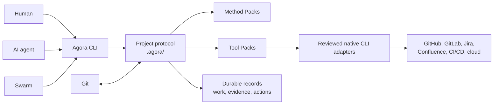
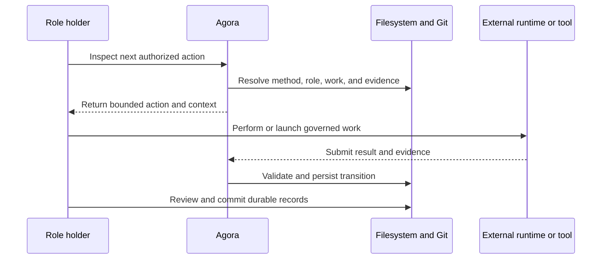
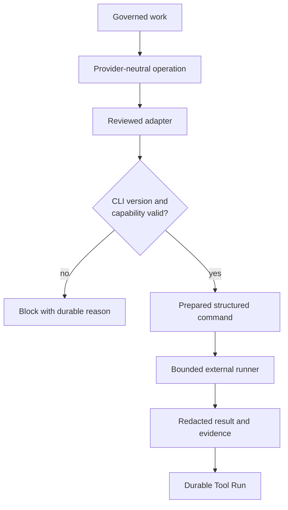

# Agora

<p align="center">
  
</p>

<p align="center">
  <strong>Agents, Governance, Orchestration, Roles & Artifacts</strong>
</p>

<p align="center">
  <a href="https://pypi.org/project/agora-framework/"></a>
  <a href="https://pypi.org/project/agora-framework/"></a>
  <a href="https://github.com/Modern-Ash/agora/actions/workflows/ci.yml"></a>
  <a href="LICENSE"></a>
</p>

Agora is a local, Markdown-first, Git-native framework for governing software delivery across
humans, AI agents, services, and swarms. It materializes the roles, lifecycle rules, permissions,
evidence, and durable work records that a team chooses for each project.

Agora is independent of the project's programming language, LLM provider, agent environment, and
development process. Its Python CLI coordinates the protocol; it does not introduce an LLM SDK or
runtime into the governed codebase.

## Project status

Agora is an **alpha (`0.x`) framework that is ready for controlled pilots**. The published CLI can
initialize and adopt repositories, execute complete governed workflows, authenticate actors,
coordinate recursive swarms, run reviewed external tools, and validate its durable state.

| Area | Current maturity |
| --- | --- |
| Core lifecycle | Implemented, exercised end to end, and covered by automated tests |
| Bundled workflows | Spec-Driven, Scrum, and Kanban Method Packs |
| Actor forms | Human, AI, service, automation, and recursively composed swarm |
| Integrations | Provider-neutral Tool Packs plus reviewed native CLI adapters |
| Persistence | Human-readable Markdown, atomic document writes, and rollback-protected work creation |
| Compatibility | Explicit project migrations and `agora upgrade` support |
| Stability | Alpha: CLI and Markdown contracts may still evolve before `1.0` |

Use Agora now for evaluation and controlled team adoption. Before production use, review the
selected Method Pack, actor permissions, execution environment, external adapters, and recovery
policy for your organization.

## Why Agora

- **One governance model for every participant.** A role can be held by a human, an AI, a service,
  or a swarm without changing the lifecycle contract.
- **Process is configuration.** Method Packs define roles, states, transitions, gates, evidence,
  and work-in-progress rules; Scrum and Kanban are examples, not hard-coded behavior.
- **The LLM remains replaceable.** Codex, Claude, local models, and custom runners consume the same
  portable commands without provider dependencies in the core.
- **Work survives the session.** Decisions, handoffs, approvals, signatures, artifacts, Tool Runs,
  and usage records remain inspectable in `.agora/` and Git.
- **External tools stay governed.** Provider-neutral capabilities are translated by reviewed,
  bounded adapters that prefer an installed native CLI.

Agora complements issue trackers, source hosts, CI/CD systems, documentation platforms, and cloud
providers. It is not a project-management UI, an agent runtime, or a replacement for those systems.

### A note on "swarm"

Multi-agent frameworks (OpenAI Swarm, AutoGen, CrewAI, LangGraph, and others) use "swarm" for
runtime coordination: several agents exchanging messages or handing off control to solve a task in
one session. Spec-driven tools (spec-kit and similar) generally have no equivalent concept at all —
one agent works a spec to completion.

An Agora swarm is neither. It is the durable governance unit for one objective: a Method Pack, the
roles it requires, and the human, AI, service, or swarm actors assigned to hold them, with every
transition checked against a permission and gate contract and recorded in `.agora/` and Git. A
swarm can be a single human role-holder and a single AI role-holder working sequentially through a
gated lifecycle — as most swarms are — or it can compose recursively into a delegated team. It is
not runtime message-passing between agents, and it does not imply parallelism or autonomy. If you
know "swarm" from a multi-agent runtime, expect Agora's version to be about *who is allowed to do
what, and the durable record of what they did* — not about how agents talk to each other.

## Architecture



Configuration is resolved predictably:

```text
Agora defaults < ~/.agora < project .agora < swarm configuration
```

## Install

Agora requires Python 3.11 or newer. Install the published CLI with
[`uv`](https://docs.astral.sh/uv/):

```bash
uv tool install agora-framework
agora self-test
```

To work from this repository:

```bash
uv sync --extra dev
uv run agora self-test
```

`self-test` runs the role conformance harness in temporary workspaces. It exercises every bundled
method with human, AI, and swarm role holders without changing the current project.

See [Installation and customization](docs/guides/installation-and-customization.md) for user-level
configuration, upgrades, editable installs, and team rollout options.

## Guided setup

The recommended first experience is an interactive review of runtime, model, Method Pack, starter
team, actor security, Git branch, and persistence scope:

```bash
cd my-project
agora setup
```

For an existing Git repository, `agora adopt` runs the read-only preflight before showing or
applying the plan. Both wizards collect one decision at a time and write nothing before final
confirmation. See the [guided setup guide](docs/guides/guided-setup.md).

Create and advance daily work without assembling long commands:

```bash
agora work start
agora continue
agora work finish
```

`work start` selects a ready swarm and compatible assigned actor, collects acceptance criteria one
at a time, and writes only after review. `continue` previews one bounded action. At a human boundary
it lets the role holder act directly, use a capability-compatible AI executor without surrendering
the role, or create a formal handoff when responsibility truly changes. `work finish` reviews
criteria, artifacts, evidence, Git policy, and approvals before recording explicit acceptance and
the Method Pack completion transition. The declarative commands remain the stable automation
surface.

## Start a governed project

### Adopt an existing repository

Run the read-only adoption preflight, then create the governed feature branch and workspace:

```bash
cd existing-service
agora adopt --check --id payment-idempotency --base main
agora quickstart \
  --id payment-idempotency \
  --base main \
  --objective "Deliver payment idempotency"
```

The preflight checks repository state, branch safety, runtime availability, reserved identities,
existing Agora state, and ignore rules. Quickstart is transactional: if a later step fails, Agora
rolls back the branch and state it created.

The executable [existing-codebase pilot](samples/existing-codebase-feature/README.md) demonstrates
this path without requiring an LLM account or network service.

### Start in a new repository

```bash
mkdir my-project
cd my-project
git init
agora quickstart --objective "Ship the first increment"
```

Quickstart initializes the protocol, registers a human and an AI actor, creates a swarm, assigns the
roles required by the active Method Pack, and writes the selected environment adapter.

Add `--secure` to generate an external Ed25519 keypair for each quickstart actor and require signed
authentication:

```bash
agora quickstart --objective "Ship the first increment" --secure
```

Private keys remain outside Agora. Only public identity, rotation or revocation history, and signed
verification evidence become durable protocol records.

## What Agora creates

Agora installs operational Markdown rather than a hidden database:

```text
<project>/
├── .agora/
│   ├── project.md              # Effective project configuration
│   ├── constitution.md         # Project principles and restrictions
│   ├── PROTOCOL.md             # Collaboration protocol
│   ├── STANDARDS.md            # Cross-actor engineering standards
│   ├── PACKS.lock.md           # Deterministic pack composition
│   ├── methods/                # Roles, transitions, gates, and policy
│   ├── actors/                 # Actor identity and public-key history
│   ├── swarms/                 # Work state and usage ledgers
│   ├── actions/                # Prepared and applied mutations
│   ├── artifacts/              # Governed artifact references
│   ├── sessions/               # Resolved execution context
│   └── tool-runs/              # External invocation requests and results
└── .agents/ or .claude/        # Environment-specific command projection
```

The repository ships the sources for these files under [`packs/`](packs/). Actor, swarm, action,
work, evidence, and Tool Run records are created dynamically as work progresses. The
[artifact location reference](docs/reference/artifact-locations.md) maps distribution sources to
their materialized project paths.

## Choose a workflow

The active Method Pack defines the lifecycle, not the CLI core.

| Bundled method | Best fit | Governs |
| --- | --- | --- |
| `spec-driven` | Feature work that needs explicit intent before implementation | Clarification, specification, planning, implementation, validation |
| `scrum` | Time-boxed delivery with accountable product and facilitation roles | Backlog, sprint flow, review, acceptance, increment evidence |
| `kanban` | Continuous pull-based delivery | Queue policy, WIP limits, review, service acceptance |

Teams can author and install a custom Method Pack for another process without changing Agora's
kernel. Start with the [Method Pack reference](docs/reference/method-packs.md) and the
[custom lifecycle sample](samples/custom-lifecycle/README.md).

## Choose an agent environment

```bash
agora configure --integration codex
agora configure --integration claude
agora configure --integration generic --provider internal --model reviewed-model
```

| Integration | Execution model |
| --- | --- |
| `codex` | Materializes portable commands for the installed Codex CLI |
| `claude` | Materializes the same protocol for the installed Claude CLI |
| `generic` | Uses an explicit structured runner supplied at launch time by the team |

The configured model and provider are project or user choices. Agora governs the resulting work;
it does not embed provider credentials or an LLM client in its core. See
[LLM environments](docs/guides/llm-environments.md). Generic sessions accept the runner explicitly,
for example `agora run --runner "company-agent run" --launch`.

Both native integrations run unattended, so their commands are built with a non-interactive
approval posture: `codex exec` runs with its own default read-only, unattended approval behavior,
and `claude --print` is launched with `--permission-mode bypassPermissions`, since a governed
session has nobody available to approve an interactive permission prompt. Changing an actor's
runtime with `agora actor runtime` takes effect immediately, including on the next automatic retry
of a failed session (`agora resume` / `agora run --until-blocked` recompute the launch command from
the actor's current runtime rather than replaying the failed attempt's command) — the one exception
is the `generic` integration, which has no runtime to derive a command from and always requires an
explicit `--runner`, so a runner-less retry there reuses the prior explicit runner.

Actors may also declare ordered, reviewed fallbacks. Agora chooses the first executable declared
runtime, and skips a runtime only when its most recent matching session contains a recognized quota
or rate-limit signal; ordinary task failures remain on the primary runtime:

```bash
agora actor runtime --actor delivery-agent \
  --integration codex --provider openai --model primary \
  --fallback claude:anthropic:fallback-model
```

For specification tooling, `agora work clarify`, `work checklist`, `work verify-consistency`, and
`work gherkin` create advisory Markdown, evidence, and artifacts without changing gate state. Use
`agora work traceability` to detect generated output made stale by changed criteria or artifacts,
and `agora status --board` for a one-frame aggregate view. See the
[spec-tooling and runtime resilience guide](docs/guides/spec-tooling-and-runtime-resilience.md).

## Run the daily loop



Use the guided controller for one reviewed action at a time. The explicit controller remains
available for bounded automation:

```bash
agora continue
agora work finish
agora next
agora run --until-blocked --max-steps 10
agora inbox
agora validate
git status --short
```

Every lifecycle mutation is checked against the active Method Pack at the time it is applied. In
authenticated projects, mutations use prepared `ACTION.md` intents whose signatures bind the actor,
operation, work preconditions, and materialized session context.

The [operational loop guide](docs/guides/operational-loop.md) covers stopping, resuming, human
handoffs, and durable failure recovery.

## Ecosystem integrations

Agora separates stable capabilities from provider-specific translation:

- Provider-neutral Tool Packs cover repositories, code review, work management, CI/CD, releases,
  repository governance, security scanning, documentation, cloud infrastructure, observability,
  and portfolio management.
- Reviewed CLI adapters currently cover the GitHub and GitLab delivery ecosystems, Jira,
  Confluence, Terraform, and read-only AWS and Google Cloud inventory.
- Native CLIs are preferred when they are installed, version-compatible, and non-interactive. MCP
  remains an explicit alternative transport rather than an implicit dependency.



Adapter commands are structured and shell-free, contain no credentials, and have explicit timeout
and captured-output limits. Write or destructive capabilities such as merge, deployment, release
publication, infrastructure apply, and incident resolution remain opt-in and policy-controlled.

Every launched operation persists `RUN.md` plus a bounded `RESULT.md`. Inspect both through the
typed read command instead of parsing provider output from terminal logs:

```bash
agora tool result --run <tool-run-id>
```

Prepared runs return `result: null`; completed and failed runs return their validated status, exit
code, result kind, `stdout`, `stderr`, and durable path. The
[Jira ACLI sample](samples/jira-cli/README.md) demonstrates this boundary through actual child
processes without requiring Jira Cloud credentials.

See the [GitHub ecosystem guide](docs/guides/github-ecosystem.md),
[CLI-first adapter guide](docs/guides/cli-first-adapters.md), and
[Tool Pack reference](docs/reference/tool-packs.md).

## Security model

Agora enforces governance at the protocol boundary while leaving operating-system isolation and
credential custody to the execution environment:

- Actor private keys and provider credentials are never stored by Agora.
- Public-key rotation and revocation history remain auditable.
- Authenticated changes are prepared, signed externally, verified, and revalidated before apply.
- Tool permissions are bounded by actor capability, role, Method Pack policy, evidence, and explicit
  approvals.
- Tool Sync is read-only and explicit; Agora performs no background reconciliation.
- Containers or external runners provide filesystem, network, syscall, and resource isolation.

Read [Actor authentication](docs/guides/actor-authentication.md),
[Signed lifecycle actions](docs/guides/signed-lifecycle-actions.md), and
[Execution boundaries](docs/guides/execution-boundaries.md) before enabling authenticated or
write-capable integrations.

## Verify Agora

Run the installed role harness:

```bash
agora self-test
```

Run the repository's complete verification pipeline:

```bash
uv sync --extra dev
uv run python scripts/verify_all.py
```

The verifier formats and lints Python, runs unit and failure-path tests, validates documentation
links and packaging, exercises the role harness, discovers and runs every executable sample, and
builds the distribution. CI repeats the supported Python-version matrix and the complete verifier.

For focused commands and expected output, see [Complete verification](docs/guides/verification.md)
and [Role conformance test harness](docs/guides/self-test.md).

## Current boundaries

Agora deliberately does not claim that governance files alone make arbitrary agent output safe or
correct. Teams remain responsible for reviewing their Method Packs, custom runners, external tool
authority, product evidence, and infrastructure isolation.

During the alpha series:

- CLI and Markdown schemas may change with explicit migrations.
- Custom Method and Tool Packs need organization-specific conformance and failure-path tests.
- Provider behavior outside a reviewed adapter's exact operation subset is unsupported.
- Production authorization should use organization-managed identities and keys, not quickstart
  credentials.
- External systems remain sources of operational state; Agora persists their verified references
  and evidence rather than silently mirroring them.
- Atomic replacement protects every individual Markdown document. Multi-document rollback currently
  covers work creation and specialized upgrade, registry, and pack transactions; extending one
  shared transaction boundary to every compound lifecycle mutation remains planned core work.

## Documentation

Start with:

- [Visual adoption guide](docs/adoption.md)
- [Quickstart guide](docs/guides/quickstart.md)
- [Getting started](docs/getting-started.md)
- [Installation and customization](docs/guides/installation-and-customization.md)

Understand the model:

- [Architecture](docs/architecture.md)
- [Domain model](docs/domain-model.md)
- [Core improvement roadmap](docs/roadmap.md)
- [Documentation and artifact locations](docs/reference/artifact-locations.md)
- [Full documentation index](docs/README.md)

Operate and extend it:

- [Operations and validation](docs/guides/operations-and-validation.md)
- [Project upgrades](docs/guides/project-upgrades.md)
- [Method Pack reference](docs/reference/method-packs.md)
- [Tool Pack reference](docs/reference/tool-packs.md)
- [Pack registries and trust](docs/guides/pack-registries.md)

Executable scenarios live under [`samples/`](samples/). They are part of the verification suite and
show the protocol working without requiring live provider credentials.

## Development

```bash
uv sync --extra dev
uv run python scripts/verify_all.py
```

Contributions must preserve Agora's language, model, provider, and process independence; keep the
protocol Markdown-first; and use Conventional Commits. See [CONTRIBUTING.md](CONTRIBUTING.md).

## License

Agora is licensed under the [Apache License 2.0](LICENSE).
