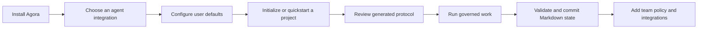
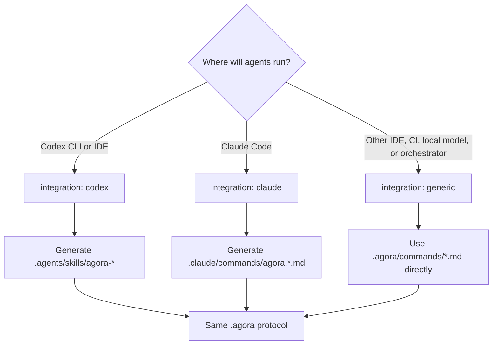
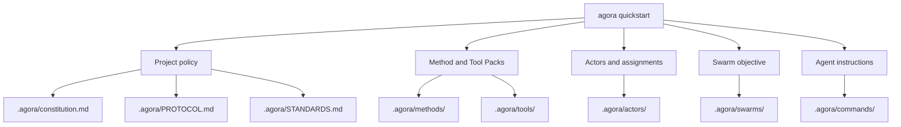
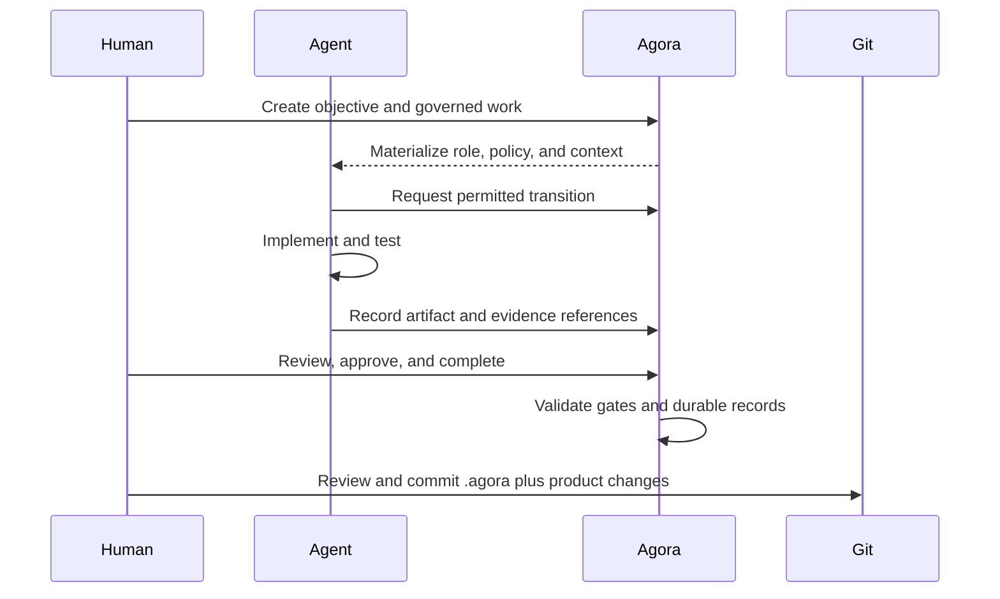
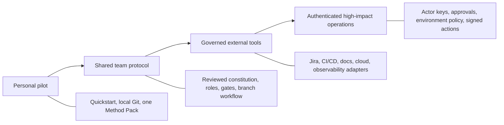

# Visual adoption guide

This guide is the shortest path from a clean machine to a governed Agora workflow. It focuses on
decisions and observable outcomes; the linked guides provide the complete command and policy
reference.

## Adoption journey



You can complete the first seven steps locally. Jira, CI/CD, cloud, documentation systems, and
remote registries remain optional adapters around the same filesystem protocol.

## 1. Install

Agora requires Python 3.11 or newer. For daily use from this checkout:

```bash
git clone https://github.com/fabianaguero/agora.git
cd agora
uv tool install .
agora --help
cd ..
```

Use `uv sync --extra dev` and prefix commands with `uv run` when contributing to Agora itself. See
[Installation and customization](guides/installation-and-customization.md) for editable installs,
wheels, virtual environments, upgrades, and removal.

## 2. Choose the execution environment

The integration controls where Agora places agent instructions. Provider and model remain opaque
configuration labels; the Agora kernel does not import an LLM SDK.



Configure personal defaults once:

```bash
agora configure \
  --integration codex \
  --provider openai \
  --model configured-by-codex \
  --default-method scrum
```

Substitute `claude` or `generic` when appropriate. See [LLM environments](guides/llm-environments.md)
for all three paths.

Choose the initial Method Pack by the shape of the work:

| Method Pack | Start with it when |
| --- | --- |
| `scrum` | Accountable roles deliver increments through explicit review and acceptance gates |
| `kanban` | Flow, WIP, and service-oriented responsibility matter more than iteration structure |
| `spec-driven` | Requirements must be clarified and accepted before implementation begins |

All three are replaceable examples. A custom Method Pack can define different roles, transitions,
gates, and required artifacts without changing Agora's kernel.

## 3. Start a project

For the fastest useful workspace:

```bash
mkdir payment-service
cd payment-service
git init
agora quickstart --objective "Deliver payment idempotency"
agora doctor
agora validate
```

Quickstart creates a project, one human actor, one AI actor, one swarm actor, a method-compatible
swarm, and its assignments. The default mode stores no private keys. Add `--secure` when every actor
should use an external Ed25519 identity from the beginning.

Use `agora init` instead when you want to register actors and form the swarm step by step.

## 4. Review what Agora created



Read the constitution, protocol, standards, selected Method Pack, and assigned role before running
work. The files are reviewable project state, not generated cache.

The complete distinction between documentation, templates, agent adapters, durable Agora records,
and external work products is in [Documentation and artifact locations](reference/artifact-locations.md).

## 5. Run the first governed work item

The exact roles and state names come from the active Method Pack. A typical execution loop is:



Prepare a durable agent session with:

```bash
agora start \
  --id implementation-session \
  --actor <actor-id> \
  --swarm <swarm-id> \
  --work <work-id>
```

Without `--launch`, this only writes `SESSION.md` and `CONTEXT.md`. With `--launch`, Agora delegates
execution to the configured local runner while keeping lifecycle authority in the filesystem.

## 6. Validate and share

```bash
agora status
agora validate
git status
git add .agora .agents
git commit -m "feat(governance): initialize Agora workflow"
```

For Claude, stage `.claude` instead of `.agents`. For `generic`, `.agora/commands` is the only command
projection. Include product changes and referenced local artifacts in the same review when useful.

## Adoption levels



### Personal pilot

- Use simple quickstart mode.
- Keep the bundled Scrum, Kanban, or spec-driven Method Pack.
- Validate before each commit.

### Shared team protocol

- Review `.agora/constitution.md`, `PROTOCOL.md`, and `STANDARDS.md` in a pull request.
- Register accountable human, AI, service, and swarm actors.
- Customize a Method Pack only when the workflow needs different roles, transitions, or gates.

### Governed integrations

- Prefer an already installed, reviewed native CLI adapter.
- Grant operations through role capabilities and project environment policy.
- Keep credentials in the provider CLI or external workload identity, never in Agora Markdown.

### High-impact operations

- Require actor authentication for signed lifecycle changes.
- Require approvals and evidence for production environments.
- Use signed releases, transparency proofs, and scoped trust for remote registries.

## Where to continue

| Goal | Guide |
| --- | --- |
| Understand every generated directory | [Documentation and artifact locations](reference/artifact-locations.md) |
| Customize installation and scopes | [Installation and customization](guides/installation-and-customization.md) |
| Run the complete manual first workflow | [Getting started](getting-started.md) |
| Compare Codex, Claude, and generic runtimes | [LLM environments](guides/llm-environments.md) |
| Deliver with Scrum roles and gates | [Scrum delivery](guides/scrum-delivery.md) |
| Manage continuous pull and WIP | [Kanban delivery](guides/kanban-delivery.md) |
| Clarify a specification before implementation | [Spec-driven delivery](guides/spec-driven-delivery.md) |
| Connect daily developer tools | [CLI-first ecosystem adapters](guides/cli-first-adapters.md) |
| Operate and validate a workspace | [Operations and validation](guides/operations-and-validation.md) |
