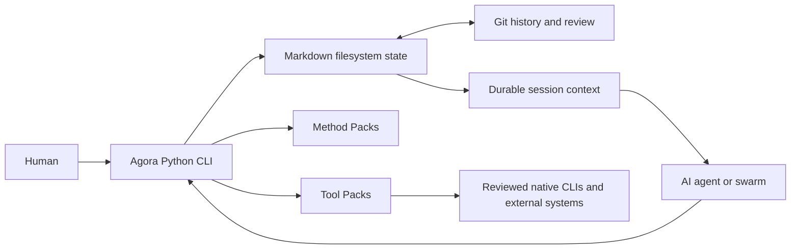

# Initial architecture

## Purpose

Agora installs a local layer for customizing and governing the complete work lifecycle of humans and
agents. The distributed product is a small Python CLI accompanied by Markdown templates. Python is
an implementation choice for the CLI, not a required language or runtime for governed projects. The
materialized product is the `.agora` directory and the selected agent adapter inside a project.



The CLI owns validation and mutation rules. LLMs, IDEs, provider CLIs, and cloud services remain
replaceable execution environments around the same protocol.

```text
Python CLI + templates
          |
          +-> ~/.agora                  personal configuration
          +-> <project>/.agora          shared protocol and state
          +-> integration adapter       agent skills or commands
          +-> Git branch                swarm isolation and history
```

## Components

### CLI

`src/agora/cli.py` translates shell commands into workspace operations. It does not maintain a server
or database, invoke an LLM, inspect project source languages, or impose a development methodology.
`src/agora/workspace.py` materializes and validates documents, capabilities, actions, workflows,
gates, granular waivers, direct and delegated approvals, handoffs, interruptions, work delegations,
sessions, and tool runs.
`src/agora/methods.py` loads
transition graphs, WIP limits, and gate policies. `src/agora/tools.py` validates provider-neutral
Tool Packs and structured external operations. `src/agora/markdown.py` implements the
JSON-compatible front matter used by the protocol. `src/agora/upgrades.py` plans ordered project
migrations, preserves customization boundaries, backs up changed files, and writes durable upgrade
manifests.
`src/agora/packs.py` validates shared pack versions, dependency declarations, and compatibility
ranges.
`src/agora/registries.py` validates installed registry snapshots and discovers Method and Tool Packs.
`src/agora/registry_distribution.py` resolves remote Markdown indexes, selects semantic releases,
enforces transport and archive limits, verifies SHA-256 and optional Ed25519 signatures, and extracts
snapshots into temporary directories before the local registry path accepts them.
`src/agora/trust.py` validates Ed25519 public-key records and durable revocation state without
handling private signing material.
`src/agora/identity.py` validates actor public identities, canonicalizes lifecycle, Tool Run, and
session authorization payloads, and verifies both live and persisted signatures without handling
private keys.

Read operations traverse those same records to produce deterministic JSON lists and summaries.
There is no query database or generated index. Full validation catches errors per record, continues
the scan, then checks portable commands, generated adapters, cross-record ownership, references,
lifecycle state, recursive graphs, and terminal results. This makes `agora validate` suitable for CI
without changing the source of truth.

### Templates

`templates/project` contains the base constitution, protocol, standards, and catalogs.
`templates/methods` provides Spec-Driven, Scrum, and Kanban as replaceable presets. User and project
scopes may install any Method Pack that satisfies the Markdown contract. `templates/commands`
contains portable instructions that adapters install as Codex skills or commands for other agents.

### Scopes

- Distribution: defaults versioned with the Python package.
- User: reusable preferences and actors under `~/.agora` or `$AGORA_HOME`.
- Project: shared constitution, integration, standards, methods, environment policies, and maximum
  delegation depth.
- Swarm: objective, current assignments, handoff history, branch, work, and evidence.

More specific scopes may restrict broader scopes. They must not silently grant permissions prohibited
by a broader scope.

Method Packs under `~/.agora/methods` are copied into a newly initialized project. Packs installed in
the project remain local to it. The active pack, rather than the core CLI, supplies lifecycle roles,
states, transitions, protocol, tool policy, and completion expectations.

Registries are immutable-by-review catalog snapshots under user or project scope. Discovery keeps
every matching provenance visible; installation resolves project before user before bundled unless a
registry id is selected explicitly. Pack installation still copies through the ordinary Method or
Tool Pack validation path.

A remote registry index is a distribution mechanism, not runtime state. Agora verifies its selected
archive and persists a complete local snapshot plus `SOURCE.md`. Governed work never depends on the
index remaining available.

Remote releases may require a threshold of distinct active Ed25519 trust keys. Multiple signer ids
sharing one fingerprint count once. The installed threshold and verified ids persist in `SOURCE.md`,
cannot be lowered by an update, and are repeated in immutable update history.

Registry trust uses the same scope rule: project keys precede user keys. Verification binds a key id
to one registry id, and a matching revocation blocks both automatic resolution and an explicit PEM.
Organizations may distribute those public keys and revocations through a signed Markdown snapshot.
Agora pins the organization's public root locally, requires a consecutive sequence and previous
checksum, previews changes before application, then transactionally archives the bundle and updates
the ordinary scoped trust store. Root rotation requires a Markdown declaration signed by both the
outgoing and incoming roots, bound to the applied bundle position and previous rotation checksum.
Historical bundles remain verified against their active root epoch. Private root keys remain
external.

Transparency log checkpoint keys live in a separate public-only trust store with independent
rotation and revocation history. Explicit verification binds the canonical registry release leaf to
an RFC 6962-style Merkle path and an Ed25519-signed checkpoint, then optionally persists the proof
for project validation. Their authority cannot satisfy a registry release signature, and proof
verification becomes a forward-only registry mutation gate only when explicitly required in
persisted registry provenance. Proof acquisition remains outside the kernel.

Registry updates are read-only plans unless application is explicit. Update staging carries forward
installer-owned history, adds the next transition record, validates the complete candidate, and only
then replaces the installed snapshot. Registry updates never mutate separately installed packs.
Aggregate audits apply the same authenticated read path to every remote registry in one scope and
may persist a Markdown notification for an external scheduler. They never apply releases or packs.

Method and Tool Pack manifests declare semantic versions and optional cross-kind dependencies.
Catalog installation resolves the complete dependency graph using registry precedence, checks the
prospective target-scope composition, and installs dependencies before their consumer. Direct source
installation requires dependencies to be present already. Project validation repeats composition
checks so manual filesystem edits cannot leave missing, incompatible, or cyclic dependencies hidden.

Each catalog-installed pack carries installer-owned `SOURCE.md` provenance with its registry,
published version, and deterministic tree checksum. Pack updates are preview-only until `--apply`,
reject downgrades and mutable versions, re-resolve the complete composition, and stage clean atomic
pack replacements. Local amendments remain valid but require explicit `--force` before replacement.
Aggregate pack audits run those previews over every managed pack in a scope and may persist a
Markdown notification. They omit direct installations and never apply a plan.
Explicit audit application binds current trees and dependency plans to the reviewed audit checksum,
rechecks the complete managed set, merges compatible plans, and performs one transactional swap.

`PACKS.lock.md` is the deterministic current-state inventory for user or project scope. Managed pack
mutations regenerate it; validation compares it with installed trees, while `agora pack lock` accepts
a reviewed manual composition. Catalog updates preserve and extend per-pack `updates/*/UPDATE.md`
chains, then swap the dependency plan as one rollback-protected operation before refreshing the lock.

Pack removal uses the same preview/apply boundary. It rejects installed reverse dependents and
durable runtime references, optionally derives unused packs only from the requested pack's
dependency closure, and stages removed trees until both `REMOVAL.md` and `PACKS.lock.md` are safely
published. A failed multi-pack removal restores the previous trees and lock.

### Git and filesystem

Markdown is the durable contract and the filesystem represents current state. Git adds history,
diffs, review, synchronization, and branches. There is no parallel JSON snapshot. Atomic replacement
keeps the previous document intact when an operation fails.

Project protocol versions are independent from individual Markdown schema identifiers. A CLI update
does not mutate a workspace. `agora upgrade` first produces a read-only plan; `--apply` backs up all
updated files, applies the supported ordered migration, and rolls back the complete change set if a
write fails. Upgrade records live beside project state under `.agora/upgrades` and are validated like
other Agora documents.

### Environment adapters

The protocol remains identical across IDE, CLI, CI/CD, and cloud environments. An adapter only
determines where executable instructions are installed:

- Codex: `.agents/skills/agora-*/SKILL.md`.
- Claude: `.claude/commands/agora.*.md`.
- Generic: `.agora/commands/*.md`.

Adding an adapter must not change Method Packs or domain rules.

Provider and model identifiers are opaque configuration values. The core has no LLM SDK dependency;
an adapter or execution environment decides how a configured model is reached.

### Session launcher

`agora start` and `agora run` compile durable context from the active project, actor, swarm, method,
role, and work.
Actor runtime fields override project defaults. Without `--launch`, the command only prepares files.
With `--launch`, it delegates to `codex`, `claude`, or an explicit runner and exports `AGORA_PROJECT`,
`AGORA_SESSION`, `AGORA_CONTEXT`, `AGORA_ACTOR`, `AGORA_SWARM`, and optional `AGORA_WORK` variables.
The external runtime remains responsible for model authentication and execution. Codex and Claude
use non-interactive native commands by default. `agora next` derives ordered actions from Method Pack
transitions, while bounded `agora run --until-blocked` recomputes durable state after every session
and stops at human attention, missing authority, unchanged governance state, or its step limit.

Session preparation and finalization use short project locks. Agora releases the lock before the
external runtime starts so that actor-owned Agora commands can persist work while `SESSION.md` is
`running`.

## External integrations

Jira, repositories, CI/CD, Confluence, cloud, and observability are modeled as Tool Packs around
external CLIs. Each operation declares an executable argument vector, inputs, risk, capability, and
optional approval role. Role policies determine which operations may be invoked. Preparation and
captured results remain in `.agora/tool-runs`; credentials are never copied into Git.

The kernel does not use a shell or vendor SDK. It performs exact argument substitution and delegates
authentication to the executable environment. The bundled Git pack is a concrete implementation;
the bundled work-management pack is a stable adapter interface whose `workctl` executable can wrap
Jira, Linear, or an internal provider. The bundled CI/CD pack applies the same pattern through
`cictl`, with separate read, run, cancel, and deployment capabilities. Vendor-specific packs remain
independently installable Markdown. The bundled knowledge-base pack similarly separates reading and
drafting from publication and archival through a stable `docsctl` adapter boundary.
The bundled cloud-infrastructure pack uses `cloudctl` to separate inspection and planning from
deployment and destructive operations, while provider identity and state remain external.
The observability pack applies the same adapter boundary to health signals and incidents, keeping
resolution distinct from evidence that recovery actually occurred.
The code-review pack separates review reads, review writing, review decisions, and merge authority.
Its GitHub Pull Requests adapter uses `gh`; no bundled role receives `review.merge`.

External runtimes and adapters may submit provider-neutral Usage records with authoritative evidence
references. Agora accumulates those append-only integer dimensions against work budget limits and
signs authenticated submissions without importing a provider metering SDK.

Actor authentication is separate from provider authentication. An actor may require an Ed25519
signature over a prepared lifecycle action, Tool Run, or agent session before execution. Agora
stores only the public key and durable proof, revalidates that proof during workspace validation,
and never signs on the actor's behalf. Lifecycle actions additionally bind authorization to a digest
of the work policy files and reapply Method Pack rules before mutation. Planned rotation is itself a
signed lifecycle action authorized by the current key; revocation and recovery require another
authenticated actor with explicit Method Pack authority and a distinct fingerprint. Public key
histories live beside the actor record; a revoked current key blocks new signed
operations while historical evidence remains independently verifiable. External CLIs still
authenticate independently to GitHub, Jira, cloud, or another provider.

Provider adapters are independently installable Tool Packs. Agora prefers a reviewed native CLI
when it is already present in the developer environment, then a team wrapper when normalization is
needed. MCP remains an optional external transport and never replaces Markdown or Git as the source
of truth. Plain adapter discovery only checks executable availability; an explicit compatibility
check runs the manifest's local version command without provider access. Selection, installation,
and every invocation remain explicit, and live invocation enforces declared minimum versions. The
bundled `github-actions`, `github-issues`, `github-pull-requests`, and `terraform` adapters are
concrete CLI-first implementations that delegate directly to `gh` and Terraform CLI.
Partial adapters declare the exact operations they implement. The AWS and Google Cloud inventory
adapters use this mechanism to provide bounded native reads without claiming plan, deployment, or
destruction behavior that the provider-wide CLIs do not possess.
The GitLab Issues adapter similarly exposes native search, view, comment, and close/reopen through
`glab` without claiming typed creation that the CLI cannot represent.
The Jira adapter implements the complete work-management contract through `acli`; it remains
discoverable but unavailable when that executable is absent. Availability never causes installation
or an MCP fallback. The `twg-confluence` adapter uses the same explicit-subset mechanism for page
view, draft creation and concurrency-safe update, publication, and archival. It requires the native
snapshot token on update and does not claim a search translation that cannot safely bind both
provider-neutral space and query inputs.

## Recursive delegation

A project actor may link its `swarm` identity to another local swarm. Assignment and handoff paths
rebuild the effective parent-to-child graph, reject cycles, and enforce the project's maximum depth.
Linked children must be ready or running when assigned and whenever their composite actor starts a
session, invokes a tool, or mutates governed work. Parent sessions include manifests, events, and
handoffs from the complete delegated descendant hierarchy without merging swarm state.

Work delegation is an explicit protocol layered on that graph. A global `DELEGATION.md` record links
parent and child work without moving either record from its owning swarm. Acceptance creates the
child item through the ordinary lifecycle API. Collection is allowed only after terminal child work
and registers a reference plus evidence in the parent. Sessions include matching delegation records;
no child artifact content is copied or merged.

Operational work status is orthogonal to Method Pack state. Blocking and cancellation update the
current owner document and append a sequenced `STATUS.md` beneath it. Swarm status is derived from
assignments and owned work, so it cannot legitimately claim completion while active work remains.
Delegations use the same status-change record shape while preserving separate parent and child
authority.

## Security and concurrency

This slice validates actor kind, capabilities, assignment, handoff authority, allowed action,
transition-specific role, WIP, gates, approval records, Tool Pack inputs, tool capabilities,
environment capability and role policy, interruption edges, status attribution, sequence
continuity, and derived swarm state.
Mutating workspace operations hold a reentrant operating-system lock keyed by the canonical project
or Agora home path. Initialization acquires home and target locks in deterministic order. A project
may additionally configure a provider-neutral external lease CLI for cross-host coordination; local
locks are acquired first and remain mandatory. Lock metadata is runtime-only while external lease
configuration is reviewed Markdown. Atomic document replacement still protects readers.

External commands still run with the caller's operating-system permissions. Tool Pack manifests and
agent Session records bound direct processes by elapsed time and captured output; those values are
persisted and covered by signed actor authorization. The built-in runners terminate timeout and
output violations and retain bounded `RESULT.md` evidence, but do not isolate filesystems, networks,
syscalls, resources, credentials, or detached descendants. Signed actor authorization currently
covers work creation and decomposition, criteria,
artifacts, evidence, transitions, interruptions, approvals, handoffs, actor key rotation, independently
authorized revocation and recovery, actor runtime updates, vacant-role assignment, the complete
delegation lifecycle, Tool Run launch, and agent-session preparation and launch. Agora does not
implement an operating-system sandbox, remote lease service, or scheduler. Optional lease adapters
coordinate writers without turning chat history or a proprietary service into the source of truth.
