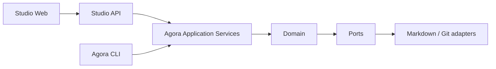

# ADR 0003: Agora Core owns lifecycle rules behind CLI and Studio

- Status: Accepted
- Date: 2026-08-20

## Context

[ADR 0001](0001-initial-architecture.md) established Agora as local, Markdown-first, and Git-native.
The first distribution exposed that model through a Python CLI, so implementation descriptions could
mistake the CLI entry point for the architectural owner of validation and lifecycle mutations.

Agora now needs three clearly separated product surfaces:

- **Agora Core**, containing the domain, application services, protocol, and persistence ports and
  adapters;
- **Agora CLI**, an optional interface for terminals, agents, and automation;
- **Agora Studio**, a web control plane that reaches Core through **Studio API**.

Without an explicit boundary, CLI command handlers or Studio endpoints could become competing homes
for lifecycle policy, Studio could couple itself to shell command syntax, and a UI-oriented database
could accidentally displace the reviewable repository protocol.

## Decision

Agora Core owns every domain invariant and lifecycle rule. This includes authorization, role and
capability checks, transitions, gates, WIP limits, preconditions, validation, mutation planning, and
persistence semantics. A rule is not part of Agora if it exists only in Agora CLI or Agora Studio.

Agora Core exposes use cases through Agora Application Services. Agora CLI and Studio API call the
same services and receive the same outcomes. They may perform interface concerns such as argument or
HTTP parsing, authentication transport, presentation, and exit-status or response mapping, but they
must not reimplement, weaken, or extend lifecycle decisions.

### Product boundaries

- **Agora Core** owns the domain model, application services, Markdown protocol, persistence ports,
  Markdown/Git adapters, and provider-neutral errors and results.
- **Agora CLI** is an optional input/output adapter for humans, agents, shell environments, and
  automation. CLI commands are not an application-service contract.
- **Agora Studio** is the browser-based control plane. Studio Web calls Studio API and never reads,
  writes, or edits `.agora/` files directly.
- **Studio API** is an HTTP adapter over Agora Application Services. It does not shell out to Agora
  CLI, translate actions into terminal commands, or define independent lifecycle behavior.

Shared request, response, event, and error contracts that cross the CLI/Core or Studio API/Core
boundaries must be serializable and explicitly versioned. Versioning applies to the boundary schema,
not to presentation details. Internal domain objects may remain implementation-specific when they do
not cross a boundary.

### Persistence and deployment scope

Markdown files and Git remain the source of truth for current state, history, review, and
synchronization. Studio is local-first throughout the 0.x series: Studio API operates against a
local Agora workspace and does not introduce a remote authority.

Remote hosting, multiuser coordination, shared server-side state, and distributed authorization are
outside the initial Studio scope. They require separate decisions because they change trust,
concurrency, identity, and deployment boundaries.

Studio may later use SQLite for search, filtering, caching, or other read performance needs only if
the database is a disposable projection that can be regenerated completely from Markdown and Git.
SQLite must not become the only location for a lifecycle fact, mutation, approval, or audit record.

## Consequences

CLI and Studio behavior can evolve independently while lifecycle semantics stay consistent. New
interfaces can reuse the same application services without gaining a separate mutation path. Core
services and contract tests become the primary place to verify both successful rules and failure
paths; interface tests verify translation and presentation.

Studio development must provide a local Studio API process or equivalent local HTTP boundary, even
when an in-process shortcut or CLI invocation would appear simpler. Studio cannot repair or mutate a
workspace by editing protocol files behind Core's persistence ports.

Serializable versioned contracts add compatibility work during the 0.x series. Contract changes
must state their version transition, and consumers must not infer stability from CLI text or
terminal formatting.

## Deferred decisions

- Authentication and origin protection for the local Studio API.
- Process topology, lifecycle, and packaging of Studio Web and Studio API.
- Contract compatibility windows and migration policy beyond the 0.x series.
- Any remote or multiuser Studio architecture.
