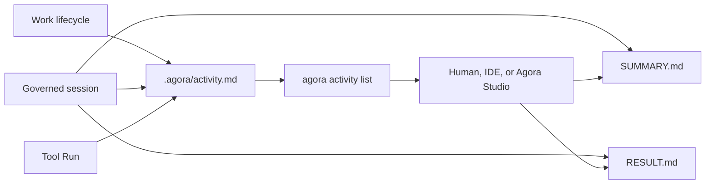
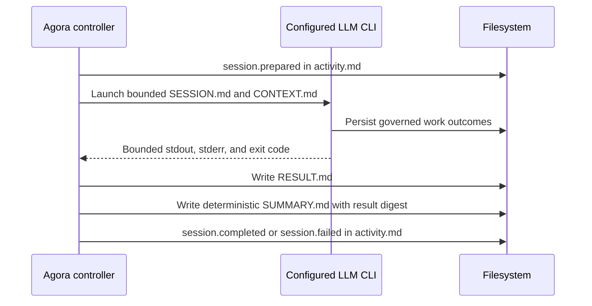

# Activity Ledger

Agora keeps a human-readable, append-only chronology in `.agora/activity.md`. It links governed
work changes, sessions, and Tool Runs to their durable source records without copying raw LLM output
into the timeline.

Bounded `agora run --until-blocked` executions also record `run-loop.stopped`, including the stop
reason and last session. This preserves why control returned to the human after terminal animation
has disappeared.



## Inspect activity

```bash
agora activity list
agora activity list --swarm studio-visual-console --work visual-console-mvp
agora activity list --session run-studio-visual-console-visual-console-mvp-20260817t120000z
agora activity list --tool-run repository-status
agora activity list --type evidence.added --limit 10
```

Every captured JSON result contains the timestamp, event type, concise summary, actor, swarm, work, session,
Tool Run, and a `repo://` source. Filters are read-only and can be combined. `--work` requires its
owning `--swarm` so work identities stay unambiguous.

Running actors may emit `session.progress` entries through `agora session progress`. These are
bounded observable milestones linked to the session's `PROGRESS.md`, not streamed provider output or
private reasoning. They let the CLI and Agora Studio explain current work without weakening the
read-only Activity Ledger contract.

For a project created before the Activity Ledger was installed, rebuild the chronology from its
existing event, session, and Tool Run records:

```bash
agora activity rebuild
agora activity list --limit 20
agora validate
```

Rebuild is an explicit, deterministic local mutation. It replaces only `.agora/activity.md`, keeps
the original records unchanged, enriches old events from their session and Tool Run manifests, and
collapses duplicate session or Tool Run events.

## Follow a governed session



`SUMMARY.md` contains Agora-owned facts: actor, roles, runtime, outcome, output size, termination
reason, context digest, and `RESULT.md` digest. `RESULT.md` remains the bounded technical audit log.
The ledger intentionally excludes hidden reasoning, credentials, and unbounded provider output.

## Persistence and validation

The Activity Ledger is ordinary repository state. Commit `.agora/activity.md`, session summaries,
and their linked records on the active work branch. `agora validate` verifies the ledger schema and
that every `repo://` source exists. Historical projects without a ledger remain readable; the next
governed activity creates it automatically.

Agora Studio and other programmatic clients should use `AgoraReadService.activity()` instead of
parsing the Markdown format themselves. The CLI exposes the same service through
`agora activity list` for terminal users. Clients may open the returned source only after the user
selects an entry.
