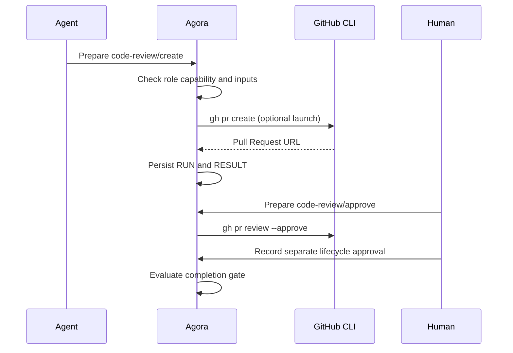

# Code-review integrations

Agora's `code-review` Tool Pack governs provider-neutral change requests. GitHub Pull Requests are a
reviewed CLI adapter, not a kernel dependency. GitLab merge requests, Gerrit changes, or internal
review systems can implement the same operation contract.

## Authority model

| Operation | Capability | Bundled default authority |
| --- | --- | --- |
| `list`, `view`, `checks` | `review.read` | Delivery, governance, and owner roles |
| `create`, `comment` | `review.write` | Delivery, governance, and owner roles |
| `approve`, `request-changes` | `review.decide` | Product, Spec, or Service Request owner |
| `merge` | `review.merge` | None; project must opt in |

External approval and Agora lifecycle approval are distinct records. A GitHub approval does not
satisfy a Method Pack gate automatically, and an Agora approval does not mutate GitHub.



## Install the GitHub adapter

```bash
gh auth status
agora tool adapter install --id github-pull-requests --scope project
agora tool show --tool github-pull-requests
agora validate
```

Installation does not contact GitHub, change the `gh` profile, or grant merge authority.

## Prepare or create a Pull Request

```bash
agora tool invoke \
  --id create-payment-review \
  --tool github-pull-requests \
  --operation create \
  --actor implementation-agent \
  --swarm delivery \
  --work payment-change \
  --input project=example/payment-service \
  --input base=main \
  --input head=agora/delivery \
  --input title="feat(payments): make retries idempotent" \
  --input description="Implements the clarified retry contract."
```

Without `--launch`, this writes the exact `gh` argument vector to `RUN.md`. Add `--launch` to execute
through the current GitHub CLI profile and capture its bounded output.

Inspect checks and register their result as evidence:

```bash
agora tool invoke \
  --id inspect-payment-checks \
  --tool github-pull-requests \
  --operation checks \
  --actor implementation-agent \
  --swarm delivery \
  --work payment-change \
  --input review=42 \
  --launch

agora evidence add --swarm delivery --work payment-change \
  --type pull-request-checks --result success \
  --artifact agora://tool-runs/inspect-payment-checks --by implementation-agent
```

## Decide and merge

An authorized owner can submit a review decision:

```bash
agora tool invoke \
  --id approve-payment-review \
  --tool github-pull-requests \
  --operation approve \
  --actor owner \
  --swarm delivery \
  --work payment-change \
  --input review=42 \
  --input body="Accepted after governed verification." \
  --launch
```

`merge` is destructive and uses the ungranted `review.merge` capability. A project that enables it
should combine a reviewed role amendment, environment policy, successful check evidence, exact Pull
Request head preconditions, and any provider branch-protection rules. Agora never infers permission
from an existing `gh` login.
