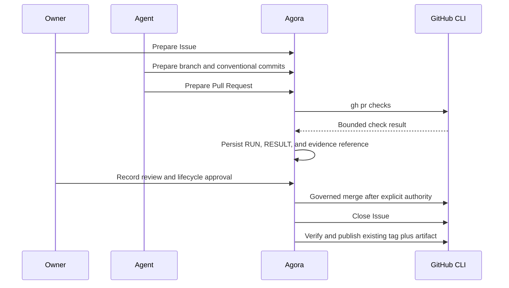

# GitHub ecosystem

Agora integrates with GitHub through the developer's existing `gh` installation. GitHub remains an
external provider: the core stores provider-neutral policy, exact command vectors, bounded results,
and evidence references in Markdown and Git.

## Coverage

| Adapter | Neutral contract | Operations | Default write authority |
| --- | --- | --- | --- |
| Core issue reconciliation | `IssueTrackerPort` | bind, read, compare, reopen local revision | None on GitHub |
| `github-issues` | `work-management` | search, view, create, comment, close, reopen | Owner roles |
| `github-pull-requests` | `code-review` | list, view, create, comment, checks, decisions, merge | Merge ungranted |
| `github-actions` | `ci-cd` | runs, workflows, cancellation, deployments | Cancel/deploy ungranted |
| `github-repository-governance` | `repository-governance` | metadata, rulesets, branch protection, policy files | Read-only |
| `github-releases` | `release-management` | list, view, verify, publish | Publish ungranted |
| `github-security` | `security-scanning` | code, dependency, and redacted secret alerts | Read-only |
| `github-projects` | `portfolio-management` | projects and item references | Owner roles |

The local `repository` Tool Pack uses Git directly for status, branches, diffs, commits, and
revisions. GitHub does not replace local repository authority.

## Install

Install and authenticate GitHub CLI outside Agora:

```bash
gh auth status
gh --version
```

Projects reads require the external profile's `read:project` scope; writes require `project`. Add
only the scope the team needs:

```bash
gh auth refresh -s read:project
# Required only for create/add/archive operations:
gh auth refresh -s project
```

Install the reviewed adapters into one Agora project:

```bash
agora tool adapter install --id github-actions --scope project
agora tool adapter install --id github-issues --scope project
agora tool adapter install --id github-projects --scope project
agora tool adapter install --id github-pull-requests --scope project
agora tool adapter install --id github-releases --scope project
agora tool adapter install --id github-repository-governance --scope project
agora tool adapter install --id github-security --scope project
agora tool adapter list --check
agora validate
```

Agora does not run `gh auth login`, refresh scopes, read tokens, or persist credentials.

Core issue reconciliation reuses the reviewed `github-issues` executable and minimum-version
declaration (`gh >= 2.45.0`) but does not require installing the adapter into project Tool Pack
state. Tool Pack installation governs explicit issue operations; reconciliation is a read-only Core
port and grants no GitHub write capability.

## Authority

Bundled roles receive routine read and collaboration capabilities. The sensitive capabilities stay
separate:

| Capability | Bundled default |
| --- | --- |
| `repository.governance.read` | All bundled roles |
| `release.read` | All bundled roles |
| `security.read` | All bundled roles |
| `portfolio.read` | All bundled roles |
| `portfolio.write` | Product, Spec, and Service Request owner roles |
| `review.merge` | None |
| `ci.cancel` | None |
| `deployment.create` | None |
| `release.publish` | None |

Grant an unassigned capability only through a reviewed project-local Method Pack amendment, refresh
`PACKS.lock.md`, and combine it with work approval and evidence policy appropriate to the target.
An authenticated `gh` profile never grants Agora authority by itself.

## Reconcile a bound GitHub issue

Bind the issue once, including the local actor whose Method Pack role Core must authorize for a
future work reopen:

```bash
agora tracker bind --id github-change-42 \
  --swarm delivery --work github-change \
  --tracker github --project example/agora --issue 42 \
  --reopen-by owner

agora --trace compact sync github --repo example/agora
agora tracker events
```

`gh issue view` returns native JSON that the adapter normalizes to the same contract used by Jira.
Agora retains the numeric issue id, `login` author subject, display name, labels, milestone, comment
count, provider update timestamp, and payload SHA-256. Repeating an unchanged payload is idempotent.
If the previous normalized state was `closed` and the new state is `open`, Core can reopen terminal
work as a new immutable revision after rechecking local authority. No GitHub comment, close, reopen,
Pull Request, check, or deployment mutation occurs on this path.

Use `agora tracker sync --tracker github --project example/agora` when an integration prefers the
provider-neutral spelling. See [Cycle revalidation and issue trackers](cycle-revalidation.md) for
revision and evidence semantics.

## Delivery path



Run the no-credential executable walkthrough:

```bash
uv run python samples/github-end-to-end/run.py
```

The sample prepares Issue, branch, Pull Request, checks, approval, merge, Issue closure, governance,
security, Projects, and release commands. It proves merge fails before explicit project policy is
added.

## Explicit synchronization

Use `agora tool sync` to launch one read-only adapter operation and persist its current external
snapshot. Sync rejects write or destructive operations before creating a Tool Run:

```bash
agora tool sync \
  --id github-main-protection-20260816 \
  --tool github-repository-governance \
  --operation view-branch-protection \
  --actor developer \
  --swarm delivery \
  --work github-change \
  --input project=example/agora \
  --input branch=main

agora tool sync \
  --id github-security-20260816 \
  --tool github-security \
  --operation list-secret-alerts \
  --actor developer \
  --swarm delivery \
  --work github-change \
  --input project=example/agora
```

The resulting `RUN.md` and `RESULT.md` live under `.agora/tool-runs/<id>/`. Register their Agora URI
as evidence when a Method Pack gate depends on the snapshot. Sync is explicit and bounded; Agora
does not run a background poller or silently reconcile remote state. Every sync ID must be new;
the command provides no force-replacement option, so earlier snapshots remain auditable.

The same mechanism can snapshot `github-issues/search`, `github-pull-requests/view` and `checks`,
`github-actions/view-run` and `view-deployment`, `github-releases/view-release`, or
`github-projects/list-items`. Each call remains a separate attributable external observation.

## Repository policy

The governance adapter reads repository merge settings, repository rulesets, exact branch
protection, and an exact policy file such as `.github/CODEOWNERS`. It intentionally has no generic
write operation. GitHub rulesets accept provider-specific JSON bodies; exposing an unchecked input
file would bypass a neutral, reviewable policy model.

Branch protection and rulesets can overlap. Persist both reads when a gate needs the effective
policy, and treat a `404` as provider evidence that the selected endpoint or plan does not expose
classic protection rather than as proof that the branch is unrestricted.

## Security snapshots

The security adapter limits each request to fifty alerts. Code and dependency alerts are reduced to
review fields. Secret scanning uses an explicit `jq` projection that excludes the response's raw
`secret` and location collection before stdout reaches Agora.

Do not add a secret value, token, or credential as a Tool input. Provider permissions remain in the
external `gh` profile, and teams should use a dedicated least-privilege security profile when
security alert scopes differ from daily repository access.

## Releases

Release publication requires an existing remote tag, an explicit artifact path, title, and notes.
The GitHub adapter passes `--verify-tag`, preventing implicit creation from the default branch.
Verify the resulting release attestation separately and register its asset digests as evidence:

```bash
agora tool invoke \
  --id verify-v1-0-0 \
  --tool github-releases \
  --operation verify-release \
  --actor owner \
  --swarm delivery \
  --work github-change \
  --input project=example/agora \
  --input release=v1.0.0 \
  --launch
```

PyPI publication is a separate distribution concern and is not implied by a GitHub Release.

## Projects

GitHub Projects is an optional portfolio view, not Agora's source of truth. Agora work remains under
`.agora/swarms`; Project items are external references to Issues or Pull Requests. The adapter can
list and create projects, list items, add an existing item URL, and archive a project item without
deleting its authoritative content.

## Live integration test

The normal test suite prepares exact commands without credentials. Run the opt-in read-only smoke
test against a repository the current `gh` profile may access:

```bash
AGORA_GITHUB_E2E_REPOSITORY=owner/sandbox \
  uv run pytest tests/test_github_live.py -q
```

The live test reads repository metadata, one Issue, one Pull Request, one Actions run, and one
release. It performs no mutation. Write-path validation belongs in a disposable repository with
separately reviewed credentials and cleanup policy.

## Failure boundaries

- A missing executable fails before launch; adapter installation still remains possible.
- An incompatible `gh` version fails the runtime compatibility check.
- Missing GitHub scopes produce a captured provider failure, not an Agora permission grant.
- Output remains subject to Tool Pack timeout and captured-output limits.
- GitHub approval and Agora lifecycle approval remain distinct durable facts.
- External branch protection and repository rules are re-evaluated by GitHub at mutation time.
