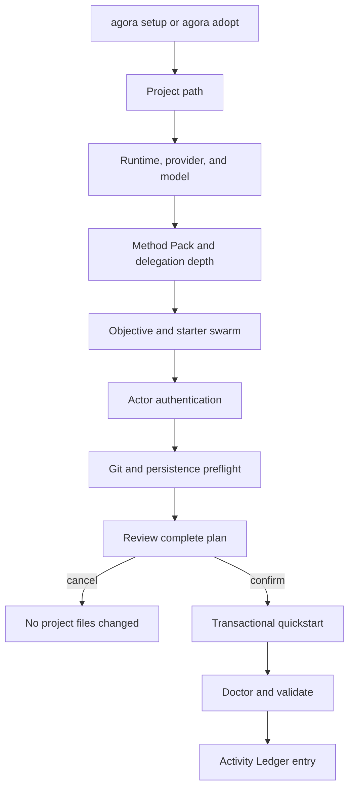
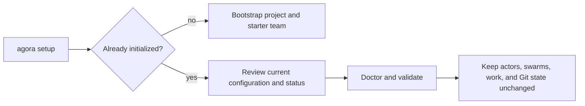
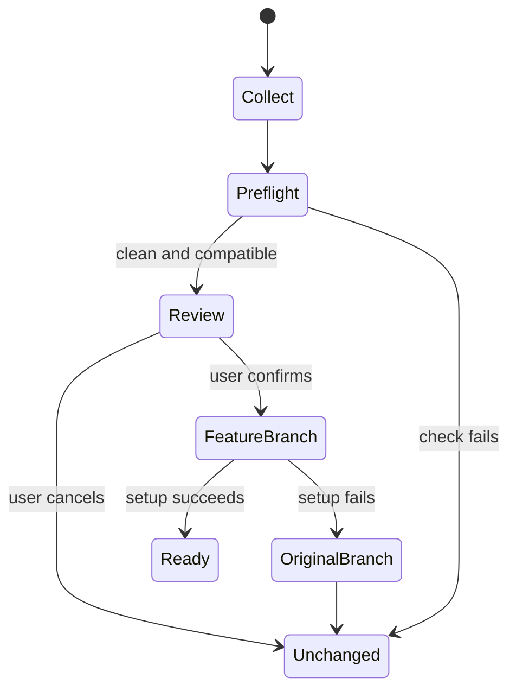

# Guided setup and adoption

`agora setup` is the recommended human entry point. It detects the local environment, collects one
decision at a time, runs a read-only preflight when Git is available, displays the complete plan,
and writes only after confirmation.



## Set up a project

From an empty directory or a repository that does not yet contain Agora state:

```bash
agora setup
```

The wizard reviews:

- project path and existing Agora state;
- native Codex, Claude, or generic runner integration;
- provider and model labels, without requesting credentials;
- Spec-Driven, Scrum, Kanban, or an installed custom Method Pack;
- recursive swarm delegation depth;
- first objective and starter swarm id;
- local identities or signed Ed25519 actors;
- Git base and generated `agora/<swarm>` branch;
- whether the choices should become user defaults.

Detected native CLIs are displayed for orientation. Setup does not silently install adapters or
grant their capabilities. Review and install those integrations separately after the project is
valid.

### Review an initialized project

Running `agora setup` again is safe and idempotent. Agora detects `.agora/project.md` before the
adoption preflight and switches to a maintenance flow:



The maintenance flow can save the existing runtime and method as user defaults, but it does not
recreate identities, swarms, or work. Use their explicit lifecycle commands when the existing
project needs to change. In automation, an initialized project requires `--non-interactive --yes`
but no new objective:

```bash
agora setup --non-interactive --yes
```

## Adopt existing code

From the clean base branch of an existing Git repository:

```bash
agora adopt
```



The preflight checks the working tree, expected base, target branch, reserved identities, runtime,
partial state, and Git persistence. `--allow-dirty` remains an explicit reviewed exception and does
not bypass any other check. Use the original read-only mode whenever only a report is needed:

```bash
agora adopt --check --id delivery --base main
```

## Automation and agents

Interactive setup requires a TTY. CI, scripts, and agents use the same entry point with explicit
consent and a required objective:

```bash
agora setup --non-interactive --yes \
  --integration codex \
  --provider openai \
  --model configured-by-codex \
  --method spec-driven \
  --id delivery \
  --objective "Deliver the accepted specification"
```

Adopt an existing repository non-interactively:

```bash
agora adopt --non-interactive --yes \
  --integration codex \
  --method scrum \
  --id payment-idempotency \
  --base main \
  --objective "Deliver payment idempotency"
```

For a new project, `--non-interactive` requires both `--yes` and `--objective`. For an initialized
project, only `--yes` is required because setup reviews existing state instead of creating work. It
never reads stdin. Lower-level `configure`, `init`, `quickstart`, actor, swarm, and assignment
commands remain stable primitives for custom assembly.

## Output and persistence

Wizard prompts and progress use `stderr`. An interactive terminal ends with a concise, colored
project summary, checks, attention, and next steps without dumping the underlying records. Agora
selects the output automatically: a terminal receives the human view, while a pipe, redirection,
IDE, or process capture receives the complete JSON contract on `stdout`. No output flag is needed.
Colors are disabled when `TERM=dumb` or when `NO_COLOR` is present.

For example, both invocations use the same command:

```bash
agora setup                         # interactive human view
agora setup --non-interactive --yes > setup-result.json
```

Confirmed setup persists ordinary Agora Markdown, branch state, actors, assignments, and optional
user defaults. It records `setup.completed` or `adopt.completed` in `.agora/activity.md`. Cancellation
occurs before mutation. A later transactional failure restores generated project state, the original
branch, and newly created external quickstart keys.

After completion:

```bash
agora status
agora activity list --type setup.completed
agora work start
agora continue
```
