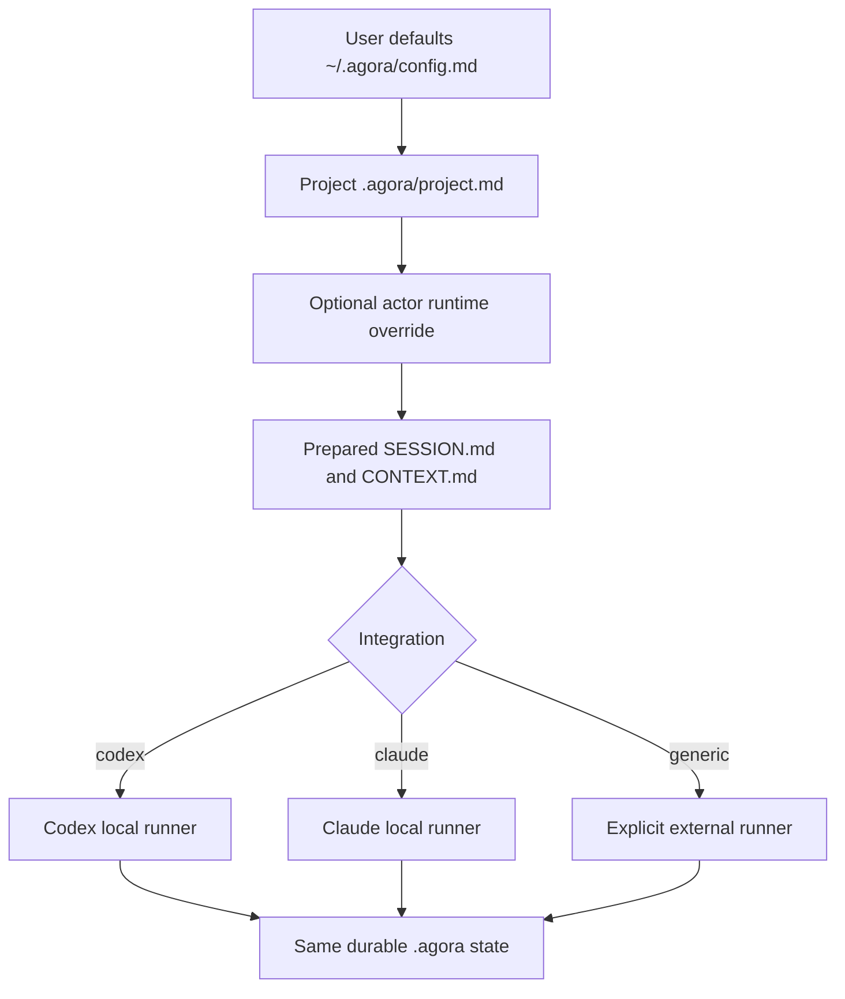

# LLM environments

Agora separates lifecycle governance from model execution. The framework records runtime selection,
installs portable instructions, and can launch a configured local runner, but it does not import an
LLM SDK, call a model API directly, or store credentials.

## Configuration fields

`~/.agora/config.md` and `.agora/project.md` contain three related fields:

| Field | Meaning | Enforced by Agora |
| --- | --- | --- |
| `integration` | Where Agora instructions are materialized | Yes: `codex`, `claude`, or `generic` |
| `provider` | Organization-selected provider or runtime label | No: opaque string |
| `model` | Environment-selected model id or alias | No: opaque string |

The separation is intentional. A model can change without rewriting roles, work state, acceptance
criteria, artifacts, evidence, or Git history.



This resolution selects an execution environment. Role assignment and Method Pack authority are
evaluated separately.

## Codex example

```bash
agora configure \
  --integration codex \
  --provider openai \
  --model configured-by-codex \
  --default-method scrum

cd my-project
agora init
```

The adapter creates one skill directory per portable Agora command:

```text
.agents/skills/
  agora-objective/SKILL.md
  agora-form-swarm/SKILL.md
  agora-specify/SKILL.md
  agora-execute/SKILL.md
  agora-review/SKILL.md
  agora-handoff/SKILL.md
  agora-complete/SKILL.md
  agora-status/SKILL.md
```

`configured-by-codex` means that Codex owns the concrete model selection. Use a model id or internal
alias instead when the project must document a specific choice.

According to the [official Codex skill documentation](https://learn.chatgpt.com/docs/build-skills),
Codex can select a skill from its description or it can be mentioned explicitly with `$` in Codex
CLI and the IDE extension. Example prompts after initialization:

```text
$agora-objective Define a governed objective for adding payment idempotency.

$agora-form-swarm Form the payment-idempotency swarm with registered actors.

$agora-review Review payment-idempotency against its criteria, artifacts, and evidence.
```

The skill tells Codex to read the project protocol and use the Agora CLI. Material state belongs in
`.agora`, not only in the conversation.

## Claude example

```bash
agora configure \
  --integration claude \
  --provider anthropic \
  --model configured-by-claude \
  --default-method scrum

cd my-project
agora init
```

The adapter materializes portable instructions as Claude command files:

```text
.claude/commands/
  agora.objective.md
  agora.form-swarm.md
  agora.specify.md
  agora.execute.md
  agora.review.md
  agora.handoff.md
  agora.complete.md
  agora.status.md
```

Agora only creates these files. Command discovery, invocation syntax, model access, permissions, and
execution remain responsibilities of the installed Claude environment.

## Generic or local model example

Use `generic` for an IDE agent, internal orchestrator, local model runner, CI job, or environment
without a dedicated Agora adapter:

```bash
agora configure \
  --integration generic \
  --provider local-runtime \
  --model team-approved-coder \
  --default-method kanban

cd my-project
agora init
```

Portable instructions remain under `.agora/commands/*.md`. The external runner should:

1. Read `.agora/project.md`, `.agora/constitution.md`, and `.agora/PROTOCOL.md`.
2. Read the active Method Pack and assigned role.
3. Supply the relevant `.agora/commands/<command>.md` content to the selected model.
4. Allow only tools permitted by the environment and project policy.
5. Invoke the Agora CLI to persist transitions, artifacts, and evidence.

`local-runtime` and `team-approved-coder` are illustrative labels. They are not built-in providers or
models and do not cause Agora to open a network connection.

## Validate generated instructions

`agora validate` parses every portable command and every adapter for the configured integration. It
detects missing files, invalid command metadata, unresolved template values, and content drift
between `.agora/commands` and Codex or Claude output:

```bash
agora doctor
agora validate
```

The validation report includes separate `commands` and `adapters` counts. See
[Complete verification](verification.md) to test all three environments and every swarm sample in
one repository run.

## Per-project overrides

User configuration supplies defaults. A new project can override them during initialization:

```bash
agora init \
  --integration generic \
  --provider internal-gateway \
  --model security-reviewed-model \
  --default-method scrum
```

For an existing project, review and edit `.agora/project.md` as a normal versioned configuration
change. Do not use `agora init --force` merely to switch a model because it also replaces generated
project protocol files.

## Mixed human and AI teams

Model selection does not assign a role. Register AI actors with explicit capabilities, then assign
them through the active Method Pack:

```bash
agora actor add \
  --id ai-facilitator \
  --name "AI Facilitator" \
  --kind ai-agent \
  --capability facilitation \
  --capability governance \
  --integration codex \
  --provider openai \
  --model configured-by-codex \
  --description "Executed through the project-selected LLM environment."
```

The actor fields are optional overrides. Missing values inherit the project configuration. Change an
actor's runtime without replacing its identity, assignments, events, or work history:

```bash
agora actor runtime --actor ai-facilitator \
  --integration generic \
  --provider internal-gateway \
  --model security-reviewed-model

agora actor runtime --actor ai-facilitator --clear
```

Declare ordered fallbacks with repeatable `--fallback` values:

```bash
agora actor runtime --actor ai-facilitator \
  --integration codex --provider openai --model primary \
  --fallback claude:anthropic:fallback-model

agora actor runtime --actor ai-facilitator --clear-fallbacks
```

Fallback selection is bounded to a fresh session. Agora uses the first declared runtime whose
executable is available and whose most recent matching session was not rejected for a recognized
quota or rate-limit condition. It does not move past ordinary nonzero exits, timeouts, output-limit
failures, or implementation errors. `SESSION.md` and `SUMMARY.md` record the runtime actually used.

`--clear` restores project inheritance. A human, AI agent, swarm, service, or automation can carry
runtime metadata; actor kind describes accountable identity, not a permanent execution technology.

When the actor requires authentication, prepare and sign the change in a swarm where its role grants
`actor.runtime.update`:

```bash
agora actor runtime-prepare --id update-ai-facilitator-runtime \
  --actor ai-facilitator --swarm payment-idempotency \
  --integration codex --provider openai --model primary \
  --fallback claude:anthropic:fallback-model
agora action authorization --action update-ai-facilitator-runtime \
  --output /tmp/update-ai-facilitator-runtime.json
# Sign the exact exported bytes outside Agora.
agora action apply --action update-ai-facilitator-runtime \
  --signature /tmp/update-ai-facilitator-runtime.sig
```

The signature binds the requested primary runtime and ordered fallbacks to the current actor and
swarm documents. Apply also rechecks the assignment and current Method Pack permission before
changing the actor record.

## Prepare and launch a session

After the actor has a swarm assignment, prepare a durable execution session:

```bash
agora start \
  --id idempotency-implementation \
  --actor ai-facilitator \
  --swarm payment-idempotency \
  --work idempotency-key
```

This resolves actor overrides over project defaults, detects the selected local runtime, and writes:

```text
.agora/sessions/idempotency-implementation/
  SESSION.md
  CONTEXT.md
  RESULT.md  # after launch
```

`CONTEXT.md` points the runner to the constitution, protocol, Method Pack, assigned role, work record,
artifacts, evidence, approvals, and events. Preparing a session does not require the runner to be
installed, which keeps planning and external delegation portable.

Use `--launch` to execute the detected command (`codex` or `claude`) in the project directory:

```bash
agora start --id idempotency-implementation --actor ai-facilitator \
  --swarm payment-idempotency --work idempotency-key --launch
```

For a generic IDE, cloud worker, or internal orchestrator, provide its command explicitly:

```bash
agora start --id internal-run --actor ai-facilitator \
  --swarm payment-idempotency --work idempotency-key \
  --runner "company-agent run" --launch
```

The child process receives `AGORA_PROJECT`, `AGORA_SESSION`, `AGORA_CONTEXT`, `AGORA_ACTOR`,
`AGORA_SWARM`, and, when selected, `AGORA_WORK`. The runner owns model authentication and should read
`AGORA_CONTEXT` before acting. Agora records the command, resolved integration/provider/model, exit
status, bounded output, and session events without binding the framework to a provider SDK. Session
launches default to a 3,600-second timeout and 4 MiB output limit. Customize them with
`--timeout-seconds` and `--max-output-bytes`; the selected values are durable and signed.

When the actor was registered with `--require-authentication`, immediate `start` is rejected. Use
`agora session prepare`, sign and apply that Lifecycle Action, then export the launch payload with
`agora session authorization`. Sign those bytes separately and launch with
`agora session launch --signature`. Preparation covers the prospective context; launch covers the
exact runtime selection, command, assignments, and materialized `CONTEXT.md` digest. See
[Actor authentication](actor-authentication.md) for the complete flow.

## Credentials and sensitive data

Never place API keys, access tokens, or cloud credentials in Agora Markdown. Keep authentication in
the selected IDE, CLI, runner, secret manager, or cloud identity system. Agora may eventually store a
non-secret credential reference, but credentials themselves remain outside Git.

Run the [LLM environments sample](../../samples/llm-environments/README.md) to inspect all three
materialized layouts without calling any model.
