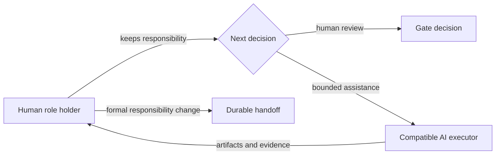
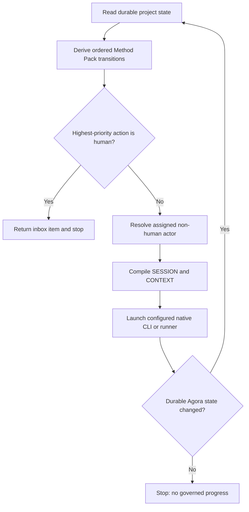
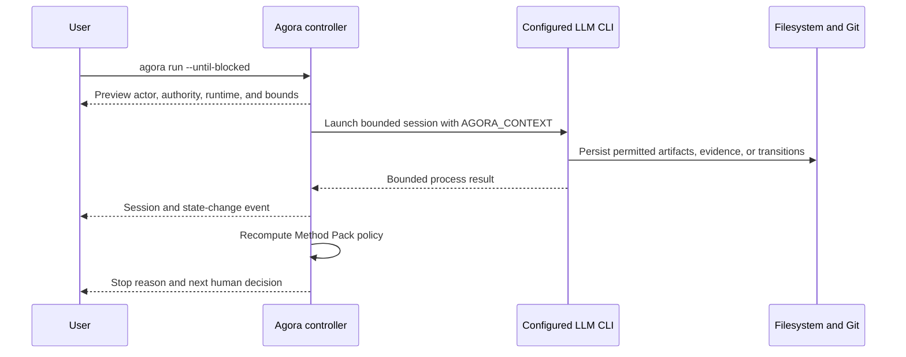

# Operational agent loop

Agora can derive the next permitted action from Method Pack state and run assigned non-human actors
through Codex, Claude, or a structured external runner. The controller remains provider-neutral and
stops before replacing a human decision.

## Recommended guided loop

For daily interactive use, start with one command:

```bash
agora continue
```

Agora selects or lets you choose one eligible work item, displays its actor, role, phase, runtime,
timeout, output boundary, and current blockers, then asks before launching exactly one non-human
action. At a human boundary, the wizard offers three explicit paths: keep the decision human, use a
compatible AI executor while the human retains the role, or create a durable handoff when the role
holder really changes. It never offers AI assistance for the terminal acceptance edge.
`agora continue --until-blocked` remains bounded and stops at the same human boundary. Automation
may use `agora continue --yes` or the lower-level `run` commands.



An executor is not a hidden handoff. `SESSION.md` and `CONTEXT.md` record both identities,
`AGORA_ACTOR` remains the responsible role holder, and `AGORA_EXECUTOR` names the runtime actor.
Executor capabilities must cover the responsible role requirements. Ownership and human approval
remain with the assigned actor.

## Inspect before execution

```bash
agora next
agora next --actor implementation-agent
agora inbox
agora inbox --actor owner
agora run --actor implementation-agent --explain
```

`next` returns role-authorized outgoing transitions, gate blockers, existing sessions, blocked-work
resumption, and vacant assignments. `inbox` uses the same derivation but returns human-owned work.
`run --explain` resolves the exact action that `run` would select and adds the actor capabilities,
LLM runtime, authentication requirement, timeout, and output boundary. None of these commands
mutates state or creates a session.



Forward transitions have priority over declared rework edges. At Scrum `reviewing`, for example,
verification is selected before returning to implementation. An actor filter cannot hide a
higher-priority human decision on the same work item; Agora stops at the human gate instead of
repeatedly launching the rework actor.

## Run one actor step

Use the configured Codex or Claude CLI:

```bash
agora run --actor implementation-agent
```

Agora launches Codex with `codex exec` and Claude with `claude --print`. Both receive an instruction
to read the path exported as `AGORA_CONTEXT`, follow the installed operational Markdown, persist the
outcome, and stop at unavailable authority. Concrete model selection is forwarded only when Agora's
model value is not delegated to the native CLI configuration.

Use a local or internal runner without changing the kernel:

```bash
agora run --actor implementation-agent \
  --runner "team-agent --mode non-interactive"
```

Runner commands are parsed into an argument vector and never evaluated by a shell. During execution
Agora exports:

```text
AGORA_PROJECT
AGORA_SESSION
AGORA_SESSION_ID
AGORA_PROGRESS
AGORA_CONTEXT
AGORA_ACTOR
AGORA_EXECUTOR
AGORA_SWARM
AGORA_WORK
```

The session lock is released before the external process starts. The actor can therefore invoke
Agora to persist transitions, artifacts, evidence, approvals, delegations, or blocks while its
session remains `running`. Short locks protect session start and finalization separately.

## Bound runner execution

Every built-in session launch has a durable elapsed-time and captured-output boundary. Defaults are
3,600 seconds and 4 MiB; accepted maxima are 86,400 seconds and 64 MiB:

```bash
agora run --actor implementation-agent \
  --timeout-seconds 1800 \
  --max-output-bytes 2097152
```

The values are written to `SESSION.md` and included in signed session authorization. A timeout exits
with code `124`; an output violation exits with code `125`. Both leave the session as `failed`, set
an explicit `termination-reason`, and persist bounded standard output and error in `RESULT.md`.
`agora resume` inherits the failed session boundaries unless replacements are supplied.

Inspect one session without opening its raw provider output:

```bash
agora session show --session run-delivery-change-20260816t120000z
agora session diagnose --session run-delivery-change-20260816t120000z
```

`session diagnose` classifies timeout, output-limit, launcher, and nonzero-exit failures, reports
captured-output utilization, detects a successful retry, and prints the bounded recovery command.
Interactive `agora continue` shows that diagnosis and asks before retrying with the recommended
timeout or output boundary. The failed session is preserved and the retry receives a new id.
Recovered failures remain in the audit history but no longer appear as unresolved attention in
`agora status`.

These limits prevent an unattended local process from running forever or producing unbounded
captured output. They are not a filesystem, network, syscall, credential, or resource sandbox.
Run untrusted workloads through a reviewed container, VM, CI runner, or organization wrapper and
pass that structured command through `--runner`.

## Understand a run while it happens

On an interactive terminal, Agora prints a non-mutating safety preview before launching the LLM:

```text
AGORA PLAN  Safe execution preview
  Work       Build the visual console [studio/visual-console]
  Actor      project:agent (ai-agent) as developer
  Authority  implementation | local actor identity
  Runtime    codex/openai/configured-by-codex (configured)
  Boundary   implementing -> verifying | 3600s | 4 MiB output
```

The animated Agora mark then retains the work title, objective, current Method Pack state, actor,
role, capabilities, authentication mode, provider, model, timeout, and output limit. A bounded loop
also leaves one durable-looking terminal line for each controller decision:

```text
AGORA [1/6] SELECT  project:agent (developer) | implementing -> verifying
AGORA [1/6] SESSION completed | implementing -> verifying | run-studio-visual
AGORA [stop] HUMAN ATTENTION | human decision: project:owner (spec-owner)
```



Agora deliberately does not display chain-of-thought, credentials, environment secrets, or raw
provider output in this view. The console contains only policy and lifecycle facts that Agora owns.
Full bounded process output remains in the session's `RESULT.md` for explicit audit. Interactive
output is written to `stderr`; scripts, pipes, and IDE capture receive the final structured JSON on
`stdout`, while a terminal receives the concise human result.

During a live session, the fixed console block includes one `Now:` line. It rotates slowly through
the active lifecycle boundary, role authority, output limit, and the durable records Agora is
watching. When the Activity Ledger receives a new artifact, criterion, evidence, tool, or transition
event, that real governed event temporarily replaces the contextual heartbeat. The line never
streams provider reasoning or raw model output, and its position remains stable so long sessions do
not flood the terminal.

The bound executor can replace the generic heartbeat with a concise durable milestone:

```bash
agora session progress \
  --session "$AGORA_SESSION_ID" \
  --by "$AGORA_EXECUTOR" \
  --summary "Automated tests passed; registering verification evidence"
```

Agora appends the message to the session's `PROGRESS.md` and emits `session.progress` in the Activity
Ledger. Summaries are length-bounded, executor-bound, and must describe observable work rather than
chain-of-thought, private reasoning, secrets, or raw provider output.
Pipes and CI do not render animation. Set `AGORA_NO_PROGRESS=1` to disable it explicitly.

Every prepared and finished session is also linked from `.agora/activity.md`. Inspect the concise
chronology without opening provider output:

```bash
agora activity list --swarm delivery --work change-api
```

Completed sessions add a deterministic `SUMMARY.md`; follow its `repo://` source to reach the
bounded `RESULT.md` only when deeper audit is necessary. See the
[Activity Ledger guide](activity-ledger.md).

## Review and close work

At a terminal Method Pack boundary, use:

```bash
agora work finish
```

The wizard presents criterion stages, required artifacts, successful evidence, configured evidence
types, Git policy, child-work obligations, and missing approvals. It refuses to invent an approval
while delivery evidence is incomplete. Once the responsible reviewer explicitly confirms and adds a
note, Agora records the approval and asks before applying the terminal transition. The underlying
`approval add` and `work transition` commands remain available for automation and signed flows.

## Run until human attention or a blocker

```bash
agora run --until-blocked
agora run --swarm delivery --until-blocked --max-steps 10
```

The controller recomputes state after every completed session and stops with one explicit reason:

| Stop reason | Meaning |
| --- | --- |
| `human-attention` | The highest-priority next action belongs to a human or a role is vacant |
| `no-agent-action` | No assigned non-human actor has an executable transition |
| `no-governed-progress` | The runner exited successfully without changing durable work policy |
| `max-steps` | The bounded execution limit was reached |

The maximum must be between 1 and 100. An explicit session id and one reusable signature are
rejected for multi-step execution because every session has distinct durable context.

## Prepare, launch, and resume

Prepare without executing:

```bash
agora run --actor implementation-agent --prepare-only
```

The next `agora run` launches that bound session rather than creating a duplicate. Resume a failed
session with a new durable id while retaining the original failure:

```bash
agora resume --session run-delivery-change-20260816t120000z
agora resume --session run-delivery-change-20260816t120000z \
  --id retry-after-runtime-recovery
```

Authenticated actors retain the two-phase signed preparation and launch flow. Agora does not reuse
one authorization across retries or multi-step execution. The signature binds timeout and output
limits as well as runtime, command, roles, and context digest.

Run the [operational loop sample](../../samples/operational-loop/README.md) to execute a real Python
subprocess that reads `AGORA_CONTEXT`, mutates the same governed workspace, prepares a Pull Request
command, stops at the human inbox, and completes the lifecycle.
