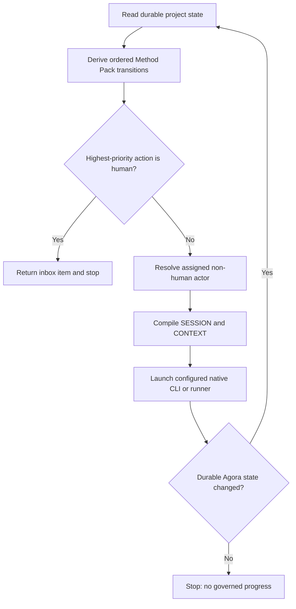
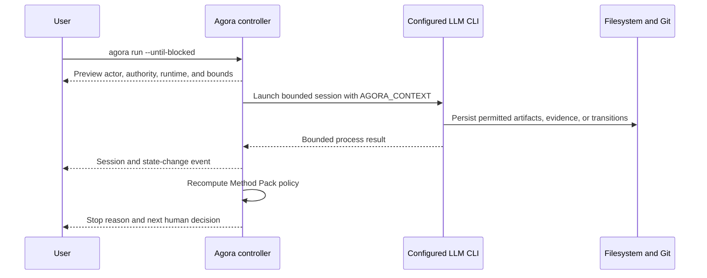

# Operational agent loop

Agora can derive the next permitted action from Method Pack state and run assigned non-human actors
through Codex, Claude, or a structured external runner. The controller remains provider-neutral and
stops before replacing a human decision.

## Inspect before execution

```bash
agora next
agora next --actor implementation-agent
agora inbox
agora inbox --actor owner
agora run --actor implementation-agent --explain
```

`next` returns role-authorized outgoing transitions, gate blockers, existing sessions, blocked-work
resumption, and vacant assignments. `inbox` uses the same derivation but returns human-owned work.
`run --explain` resolves the exact action that `run` would select and adds the actor capabilities,
LLM runtime, authentication requirement, timeout, and output boundary. None of these commands
mutates state or creates a session.



Forward transitions have priority over declared rework edges. At Scrum `reviewing`, for example,
verification is selected before returning to implementation. An actor filter cannot hide a
higher-priority human decision on the same work item; Agora stops at the human gate instead of
repeatedly launching the rework actor.

## Run one actor step

Use the configured Codex or Claude CLI:

```bash
agora run --actor implementation-agent
```

Agora launches Codex with `codex exec` and Claude with `claude --print`. Both receive an instruction
to read the path exported as `AGORA_CONTEXT`, follow the installed operational Markdown, persist the
outcome, and stop at unavailable authority. Concrete model selection is forwarded only when Agora's
model value is not delegated to the native CLI configuration.

Use a local or internal runner without changing the kernel:

```bash
agora run --actor implementation-agent \
  --runner "team-agent --mode non-interactive"
```

Runner commands are parsed into an argument vector and never evaluated by a shell. During execution
Agora exports:

```text
AGORA_PROJECT
AGORA_SESSION
AGORA_CONTEXT
AGORA_ACTOR
AGORA_SWARM
AGORA_WORK
```

The session lock is released before the external process starts. The actor can therefore invoke
Agora to persist transitions, artifacts, evidence, approvals, delegations, or blocks while its
session remains `running`. Short locks protect session start and finalization separately.

## Bound runner execution

Every built-in session launch has a durable elapsed-time and captured-output boundary. Defaults are
3,600 seconds and 4 MiB; accepted maxima are 86,400 seconds and 64 MiB:

```bash
agora run --actor implementation-agent \
  --timeout-seconds 1800 \
  --max-output-bytes 2097152
```

The values are written to `SESSION.md` and included in signed session authorization. A timeout exits
with code `124`; an output violation exits with code `125`. Both leave the session as `failed`, set
an explicit `termination-reason`, and persist bounded standard output and error in `RESULT.md`.
`agora resume` inherits the failed session boundaries unless replacements are supplied.

These limits prevent an unattended local process from running forever or producing unbounded
captured output. They are not a filesystem, network, syscall, credential, or resource sandbox.
Run untrusted workloads through a reviewed container, VM, CI runner, or organization wrapper and
pass that structured command through `--runner`.

## Understand a run while it happens

On an interactive terminal, Agora prints a non-mutating safety preview before launching the LLM:

```text
AGORA PLAN  Safe execution preview
  Work       Build the visual console [studio/visual-console]
  Actor      project:agent (ai-agent) as developer
  Authority  implementation | local actor identity
  Runtime    codex/openai/configured-by-codex (configured)
  Boundary   implementing -> verifying | 3600s | 4 MiB output
```

The animated Agora mark then retains the work title, objective, current Method Pack state, actor,
role, capabilities, authentication mode, provider, model, timeout, and output limit. A bounded loop
also leaves one durable-looking terminal line for each controller decision:

```text
AGORA [1/6] SELECT  project:agent (developer) | implementing -> verifying
AGORA [1/6] SESSION completed | implementing -> verifying | run-studio-visual
AGORA [stop] HUMAN ATTENTION | human decision: project:owner (spec-owner)
```



Agora deliberately does not display chain-of-thought, credentials, environment secrets, or raw
provider output in this view. The console contains only policy and lifecycle facts that Agora owns.
Full bounded process output remains in the session's `RESULT.md` for explicit audit. Interactive
output is written to `stderr`; the final structured JSON stays on `stdout` for scripts and IDEs.
Pipes and CI do not render animation. Set `AGORA_NO_PROGRESS=1` to disable it explicitly.

## Run until human attention or a blocker

```bash
agora run --until-blocked
agora run --swarm delivery --until-blocked --max-steps 10
```

The controller recomputes state after every completed session and stops with one explicit reason:

| Stop reason | Meaning |
| --- | --- |
| `human-attention` | The highest-priority next action belongs to a human or a role is vacant |
| `no-agent-action` | No assigned non-human actor has an executable transition |
| `no-governed-progress` | The runner exited successfully without changing durable work policy |
| `max-steps` | The bounded execution limit was reached |

The maximum must be between 1 and 100. An explicit session id and one reusable signature are
rejected for multi-step execution because every session has distinct durable context.

## Prepare, launch, and resume

Prepare without executing:

```bash
agora run --actor implementation-agent --prepare-only
```

The next `agora run` launches that bound session rather than creating a duplicate. Resume a failed
session with a new durable id while retaining the original failure:

```bash
agora resume --session run-delivery-change-20260816t120000z
agora resume --session run-delivery-change-20260816t120000z \
  --id retry-after-runtime-recovery
```

Authenticated actors retain the two-phase signed preparation and launch flow. Agora does not reuse
one authorization across retries or multi-step execution. The signature binds timeout and output
limits as well as runtime, command, roles, and context digest.

Run the [operational loop sample](../../samples/operational-loop/README.md) to execute a real Python
subprocess that reads `AGORA_CONTEXT`, mutates the same governed workspace, prepares a Pull Request
command, stops at the human inbox, and completes the lifecycle.
