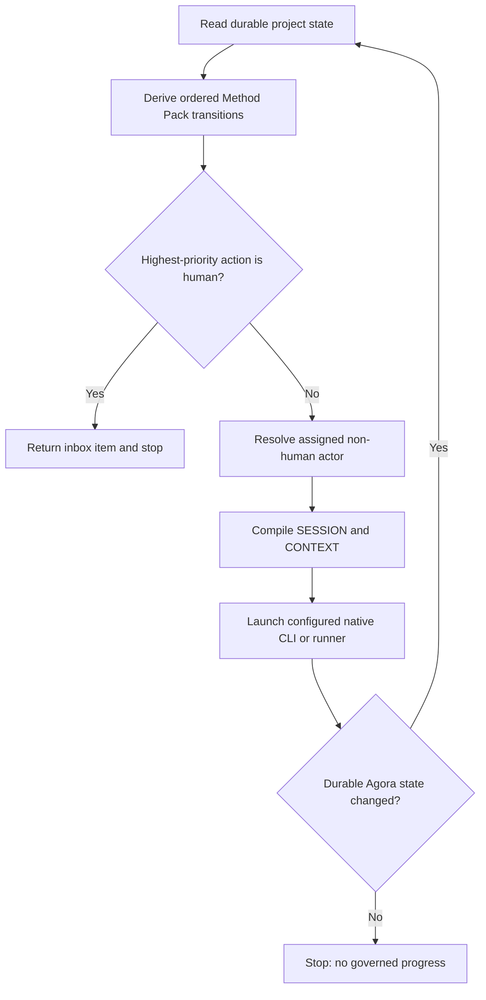

# Operational agent loop

Agora can derive the next permitted action from Method Pack state and run assigned non-human actors
through Codex, Claude, or a structured external runner. The controller remains provider-neutral and
stops before replacing a human decision.

## Inspect before execution

```bash
agora next
agora next --actor implementation-agent
agora inbox
agora inbox --actor owner
```

`next` returns role-authorized outgoing transitions, gate blockers, existing sessions, blocked-work
resumption, and vacant assignments. `inbox` uses the same derivation but returns human-owned work.
Neither command mutates state.



Forward transitions have priority over declared rework edges. At Scrum `reviewing`, for example,
verification is selected before returning to implementation. A rework actor can still be selected
explicitly with `--actor`.

## Run one actor step

Use the configured Codex or Claude CLI:

```bash
agora run --actor implementation-agent
```

Agora launches Codex with `codex exec` and Claude with `claude --print`. Both receive an instruction
to read the path exported as `AGORA_CONTEXT`, follow the installed operational Markdown, persist the
outcome, and stop at unavailable authority. Concrete model selection is forwarded only when Agora's
model value is not delegated to the native CLI configuration.

Use a local or internal runner without changing the kernel:

```bash
agora run --actor implementation-agent \
  --runner "team-agent --mode non-interactive"
```

Runner commands are parsed into an argument vector and never evaluated by a shell. During execution
Agora exports:

```text
AGORA_PROJECT
AGORA_SESSION
AGORA_CONTEXT
AGORA_ACTOR
AGORA_SWARM
AGORA_WORK
```

The session lock is released before the external process starts. The actor can therefore invoke
Agora to persist transitions, artifacts, evidence, approvals, delegations, or blocks while its
session remains `running`. Short locks protect session start and finalization separately.

## Run until human attention or a blocker

```bash
agora run --until-blocked
agora run --swarm delivery --until-blocked --max-steps 10
```

The controller recomputes state after every completed session and stops with one explicit reason:

| Stop reason | Meaning |
| --- | --- |
| `human-attention` | The highest-priority next action belongs to a human or a role is vacant |
| `no-agent-action` | No assigned non-human actor has an executable transition |
| `no-governed-progress` | The runner exited successfully without changing durable work policy |
| `max-steps` | The bounded execution limit was reached |

The maximum must be between 1 and 100. An explicit session id and one reusable signature are
rejected for multi-step execution because every session has distinct durable context.

## Prepare, launch, and resume

Prepare without executing:

```bash
agora run --actor implementation-agent --prepare-only
```

The next `agora run` launches that bound session rather than creating a duplicate. Resume a failed
session with a new durable id while retaining the original failure:

```bash
agora resume --session run-delivery-change-20260816t120000z
agora resume --session run-delivery-change-20260816t120000z \
  --id retry-after-runtime-recovery
```

Authenticated actors retain the two-phase signed preparation and launch flow. Agora does not reuse
one authorization across retries or multi-step execution.

Run the [operational loop sample](../../samples/operational-loop/README.md) to execute a real Python
subprocess that reads `AGORA_CONTEXT`, mutates the same governed workspace, prepares a Pull Request
command, stops at the human inbox, and completes the lifecycle.
