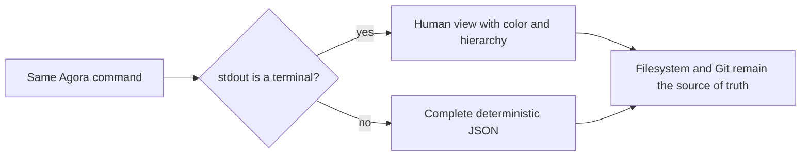

# Operations and validation

Agora keeps operational state in Markdown, but daily users and automation should not need to scan
every directory manually. Query commands read the same files used by lifecycle operations and emit
deterministic views without creating a second state store. A human terminal receives a concise,
colored view; pipes, redirections, IDEs, and process capture receive the same data as structured JSON
automatically. No output-format flag is required.



## Engine visibility in terminals, chat, and CI

The final command result remains on `stdout`. Enable a separate, line-oriented engine trace on
`stderr` when a human or chat host needs to see the phases while Agora is running:

```bash
agora --trace compact run --swarm delivery --until-blocked
agora --trace detailed tracker sync --tracker github --project owner/repository
AGORA_TRACE=jsonl agora status
```

The modes are `off`, `compact`, `detailed`, and `jsonl`; a command-line value overrides
`AGORA_TRACE`. `compact` is intended for conversation relay, `detailed` adds stable codes and the
operation id, and `jsonl` emits `agora/application/engine-trace-event/v1`. Every event contains an
operation id, monotonic sequence, phase, status, code, bounded summary, UTC timestamp, and string
references. Trace output is flushed per event even when no TTY is attached.

Trace events are an observation channel, not another ledger. They exclude provider output,
credentials, prompts, and model reasoning, and they never replace `SESSION.md`, Tool Run results,
work events, or the Activity Ledger. Agora-launched Codex and Claude sessions inherit
`AGORA_TRACE=compact` unless the caller already chose another mode.

## Project status

Run a compact project-wide summary from the project or with the global project selector:

```bash
agora status
agora status --board
agora --project /path/to/project status
```

The result includes the selected integration, default Method Pack, current Git branch, domain
counts, lifecycle and operational status distributions, and attention lists. Attention currently
identifies forming swarms, active and blocked work, open delegations, unfinished or failed sessions,
and failed tool runs.

`status` is a read operation. It does not repair records, advance work, or infer completion.
`--board` replaces the summary rendering with one fixed-width frame per swarm and columns derived
from each swarm's Method Pack states. The machine-readable contract of plain `agora status` remains
unchanged.

## Domain queries

Every list command returns records in deterministic filesystem order. They are rendered for a
terminal and remain JSON when captured or piped:

```bash
agora actor list
agora actor list --scope project
agora method list
agora tool list
agora tool runs --status failed
agora swarm list
agora swarm list --status running
agora swarm handoffs --swarm delivery
agora work list
agora work list --swarm delivery --state reviewing
agora work list --swarm delivery --operational-status blocked
agora work inspect --swarm delivery --work payment-api
agora work status-changes --swarm delivery --work payment-api
agora work traceability --swarm delivery --work payment-api
agora delegation list --status accepted
agora delegation list --status cancelled
agora delegation status-changes --delegation specialist-task
agora session list --status prepared
agora tracker bindings
agora tracker events
```

Filters match persisted values exactly. An empty machine result is an empty JSON array, not an
error; the terminal view instead reports that no items were found.

`work inspect` is the default read for one agent iteration. It returns a bounded, consistent
decision summary: current state, available transitions and blockers, role assignments, criteria and
material counts, required and missing artifacts, and a snapshot token. Use `work inspect --full` or
a targeted query only when that summary indicates more context is necessary. The compact projection
is an optimization of reads and output, not a weaker lifecycle or authorization check.

`work traceability` is a non-mutating derived view. It maps criteria and stages to generated Gherkin,
directly linked evidence, and shared artifacts, then compares recorded provenance hashes with the
current work inputs.

## Inspect a Tool Run result

Listing Tool Runs answers which operations exist. Inspecting one run answers what exact command was
governed and what bounded output the provider process returned:

```bash
agora tool runs
agora tool result --run verify-created-jira-work
```

The result contains two typed objects:

- `run`: tool and operation ids, actor, swarm, optional work and environment, capability, risk,
  inputs, structured command, runtime status, authentication evidence, limits, and durable path;
- `result`: terminal status, exit code, result kind, bounded `stdout` and `stderr`, and the
  `RESULT.md` path, or `null` while the run remains prepared.

Agora does not parse provider JSON into a universal ticket, deployment, or review model. The typed
boundary verifies Agora metadata and returns provider output unchanged. Adapters and callers remain
responsible for interpreting their declared result kind.

Inspection rejects a terminal result that does not match its `RUN.md` identity, status, exit code,
or result kind. Full validation reports the same condition with stable code
`tool-result.invalid`.

## Event inspection

Project, swarm, and work event files use the same timestamped record shape. Query the most recent
events across the project:

```bash
agora event list --limit 20
```

Narrow the result to a swarm, one work item, or an exact event type:

```bash
agora event list --swarm delivery --limit 20
agora event list --swarm delivery --work payment-api
agora event list --type delegation.collected
```

`--work` requires `--swarm`. Results are ordered by their ISO timestamp and include their durable
scope and source path.

## Environment check versus full validation

`agora doctor` is a shallow installation check. It reports whether the project, selected adapter,
default method, tool policy, repository Tool Pack, delegation setting, and Git environment are
available.

`agora validate` is a complete integrity audit:

```bash
agora validate
```

It checks:

- Required project documents and schema identifiers.
- Portable agent commands and Codex, Claude, or generic adapter completeness and consistency.
- Method Pack graphs, roles, gates, WIP definitions, and project default selection.
- Tool Pack operations, inputs, risks, and result contracts.
- Project standards and registered Tool Pack input rules, including Conventional Commits 1.0.0.
- Actor documents, ids, kinds, capabilities, and referenced user actors.
- Swarm identity, status, assignments, role compatibility, recursive cycles, and depth.
- Work identity, owning swarm, lifecycle and operational states, criteria, companion registers, WIP,
  interruption history, revision continuity and snapshot digests, advisory records,
  generated-output provenance, and derived swarm state.
- Structured evidence ids, revision ownership, deduplication keys, test counts, tested commits,
  registered artifact digests, and non-empty successful artifacts.
- Issue-tracker binding ownership, normalized snapshot identity and digest, immutable reconciliation
  event identity, and missing binding references.
- Handoff identities, roles, actors, and optional work references.
- Delegation parent and child records, attribution, lifecycle links, interruption sequence, and
  collected results.
- Session references, roles, context files, and runtime metadata.
- Tool run references, operation contracts, and terminal result documents.
- Project, swarm, and work event syntax and timestamps.

Validation continues after an invalid record so one run can report multiple independent issues. The
captured JSON response contains `checked` counts and issues with `severity`, stable `code`, `path`,
and `message` fields.

Errors set `ok` to `false` and make the CLI exit with status `1`. Warnings remain visible but do not
fail validation. A valid workspace exits with status `0`, making the command suitable for CI:

```bash
agora validate > agora-validation.json
```

Advisory provenance uses warnings so normal content evolution does not block delivery. Stable codes
include `clarifications.stale` and `artifact.stale`; legacy generated records without an input hash
receive `clarifications.provenance-missing` or `artifact.provenance-missing`. Review and regenerate
the affected output,
then rerun validation. Agora never regenerates or deletes it implicitly.

The validator never rewrites files. Repair remains an explicit, reviewable change to the Markdown
source of truth.

Run the [operational query sample](../../samples/operational-query/README.md) for an executable
workspace summary and validation report.

To verify the framework repository, every bundled sample, and the built distributions together, use
the [complete verification guide](verification.md).
