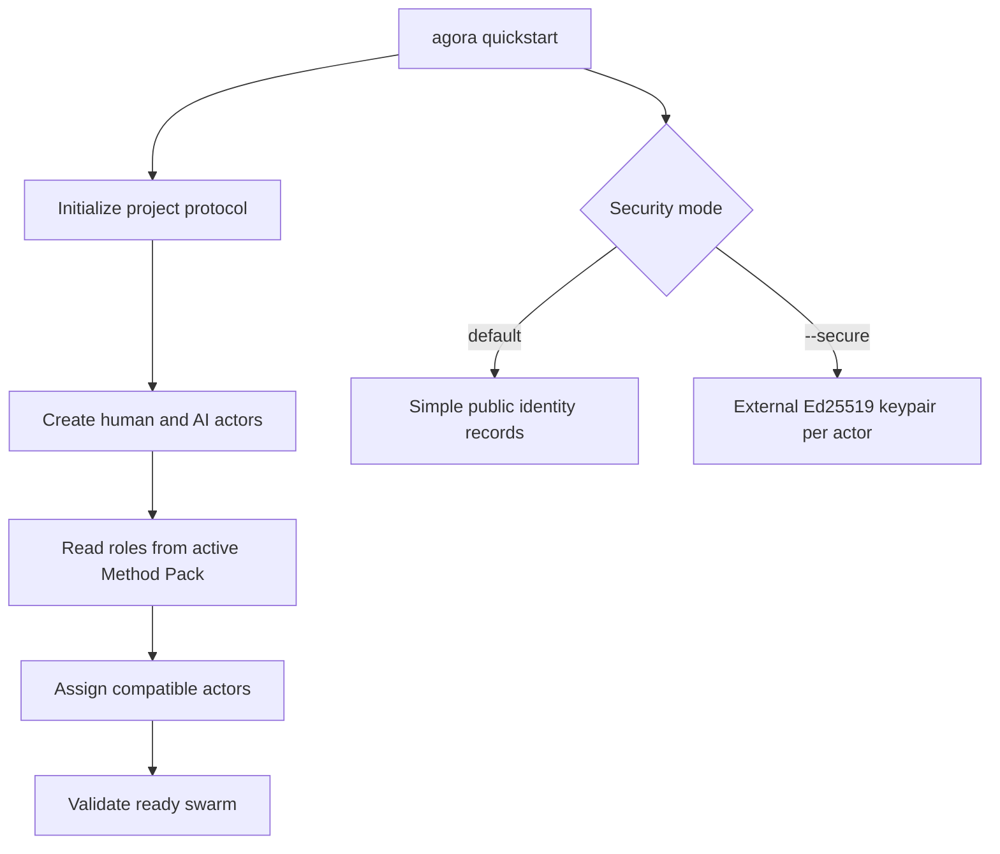
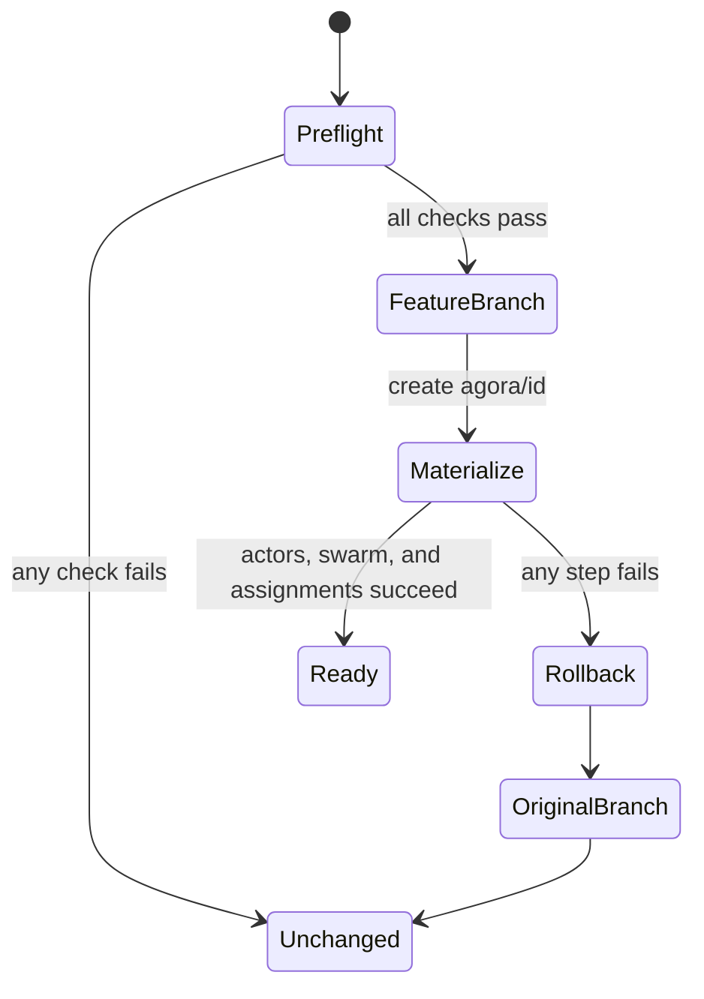

# Quickstart

For human onboarding, prefer [`agora setup`](guided-setup.md) or `agora adopt`. They collect and
review the same inputs sequentially, then delegate to the transactional quickstart implementation.
Use this guide for direct CLI automation and the underlying behavior.

`agora quickstart` creates the smallest runnable Agora project without privileging one development
method, LLM provider, or programming language. It initializes the project, creates one human and one
AI actor, creates a swarm, and assigns every required role declared by the selected Method Pack.



## Simple mode

From an empty project directory:

```bash
agora quickstart --objective "Deliver the first increment"
```

The default mode creates:

- project actor `owner`, assigned the method's first required role;
- project actor `agent`, assigned the remaining required roles;
- swarm `quickstart`, using the project's default Method Pack;
- capabilities derived from each role's `required-capabilities` declaration.

Both actors are intentionally unauthenticated. No key or signature is generated, and the ordinary
filesystem and Method Pack rules still govern their work. This mode is useful for learning and local
experiments, not for granting production authority.

Select another bundled or installed Method Pack and swarm id with:

```bash
agora quickstart \
  --id delivery \
  --method kanban \
  --objective "Reduce delivery lead time"
```

The role and capability calculation is identical for Spec-Driven, Scrum, Kanban, and custom Method
Packs.

## Secure exploration mode

Require both generated actors to authenticate governed operations:

```bash
agora quickstart \
  --objective "Deliver an authenticated increment" \
  --secure
```

Agora generates Ed25519 keypairs for local exploration. Private keys never enter `.agora`, actor
Markdown, events, or Git-managed verification evidence. By default they live under:

```text
~/.config/agora-quickstart-keys/<project-hash>/
```

The captured JSON result reports the exact `key_directory`. Choose an external location explicitly when
needed:

```bash
agora quickstart --secure \
  --key-dir ~/.my-team/dev-actor-keys \
  --objective "Deliver an authenticated increment"
```

The directory is mode `0700` and generated private PEM files are mode `0600`. Agora rejects partial,
non-Ed25519, or mismatched pre-existing keypairs. Only their public counterparts are imported into
the actor trust records.

Quickstart keys do not replace a production keychain, hardware device, secret manager, agent host,
or workload identity. Follow [Actor authentication](actor-authentication.md) to prepare, externally
sign, and verify governed operations.

## Existing projects and reruns

Run the read-only preflight before adopting a non-empty Git repository:

```bash
agora adopt --check --id delivery --base main
agora quickstart \
  --id delivery \
  --base main \
  --objective "Deliver the first governed feature"
```

The preflight reports every check as JSON and returns status `1` when the repository is not ready.
It checks the current and target branches, working tree, partial state, reserved ids, configured
runtime, and whether Git can persist `.agora` plus the selected integration projection.



Quickstart can also use an initialized project when the reserved actor and swarm ids remain unused.
It does not overwrite or silently reuse `owner`, `agent`, or the requested swarm. On any failure it
restores the prior `.agora` tree, removes only newly generated integration files and quickstart keys,
switches back to the original branch, and deletes the failed branch. Existing product files and
pre-existing external keys remain untouched.

The default requires a clean working tree. `--allow-dirty` accepts reviewed local changes but does
not bypass branch, persistence, identity, runtime, or partial-state checks.

Use explicit commands when the project needs different actor ids, more actors, custom role
allocation, user-scoped identities, runtime configuration, or production keys:

```bash
agora init
agora actor add --id product-owner --name "Product Owner" --kind human \
  --capability backlog-management --capability acceptance
agora actor add --id delivery-agent --name "Delivery Agent" --kind ai-agent \
  --capability implementation
agora swarm create --id delivery --objective "Deliver the approved objective"
```

`agora validate` checks the resulting actors, assignments, Method Pack references, public identity,
and swarm state in either mode.
