# Role conformance test harness

Agora includes a zero-configuration test harness for checking an installed distribution before a
person or team adopts it:

```bash
agora self-test
```

The command needs no initialized project, provider account, LLM, key, repository, or network
connection. It creates isolated temporary workspaces, exercises the bundled lifecycle contracts,
prints a human terminal report or captured JSON, and removes the workspaces when complete.

## Fastest confidence check

Run the harness immediately after installation, before choosing a provider or creating a project:

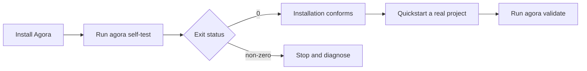

For an isolated command-line installation:

```bash
pipx install agora-framework
agora self-test
```

For development from a checkout:

```bash
uv sync --extra dev
uv run agora self-test
```

Success returns exit status `0` and a report whose top-level `ok` value is `true`. Any exception or
contract violation makes the command fail, so it can be used directly as a CI step.

## Coverage at a glance

The harness evaluates the Cartesian product of all bundled Method Packs and all role-holder forms
supported by the conformance suite:

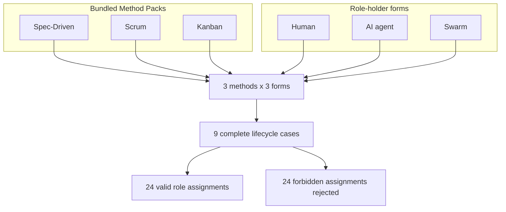

The role counts are derived from the installed Method Pack manifests, not duplicated in a test-only
role catalog:

| Method Pack | Required roles | Cases | Valid assignments | Forbidden assignments rejected |
| --- | --- | ---: | ---: | ---: |
| Spec-Driven | `spec-owner`, `developer` | 3 | 6 | 6 |
| Scrum | `product-owner`, `scrum-master`, `developer` | 3 | 9 | 9 |
| Kanban | `service-request-manager`, `flow-manager`, `delivery` | 3 | 9 | 9 |
| **Total** | **8 role definitions per actor-form pass** | **9** | **24** | **24** |

Each actor receives the union of `required-capabilities` declared by the roles in the active Method
Pack. This proves that actor-kind policy is enforced independently of capability compatibility.

## What one case does

Every method and actor-form pair follows the same deterministic sequence:

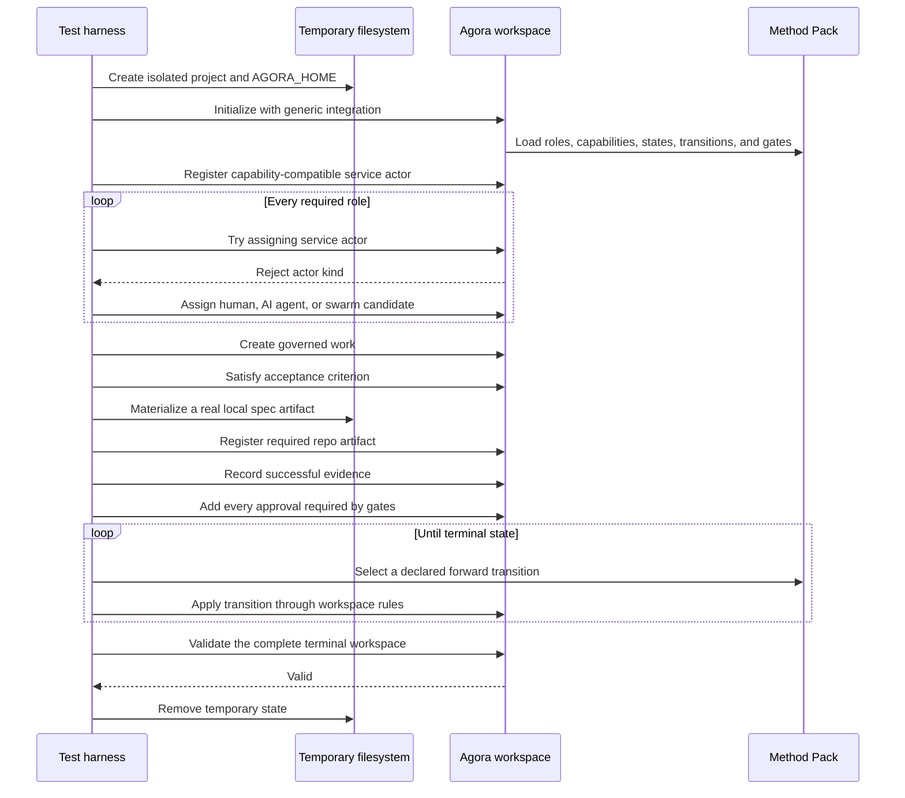

This is not a mocked parser test. The harness calls the same `AgoraWorkspace` operations used by the
CLI for actor registration, swarm formation, work mutation, gate evaluation, and validation.

## How actor forms are exercised

The role contract stays constant while only the role holder changes:

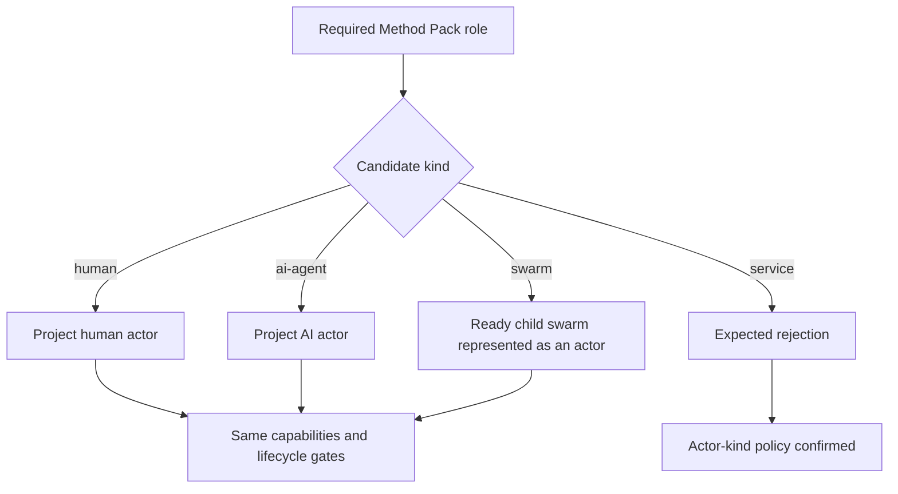

For the `swarm` form, the harness first creates a child swarm, assigns a helper human to every child
role, and verifies that the child is ready. It then registers an actor representing that child swarm
and assigns the representative to the parent delivery roles. Recursive readiness is therefore part
of the exercised path.

The `service` candidate deliberately has every required capability. Its rejection demonstrates that
capabilities alone cannot bypass the `allowed-actor-kinds` declared by a role.

## Lifecycle paths

Each case follows only declared transitions that move forward in the Method Pack state order. Rework
edges are valid production behavior, but the deterministic installation check takes the successful
path:

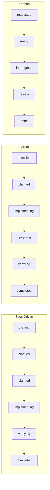

Before these transitions, every case creates the minimum complete body of governed work:

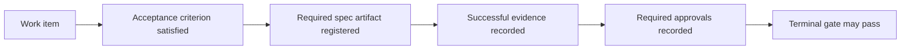

## Isolation and persistence

The harness tests filesystem persistence without modifying the user's real Agora home or current
project:

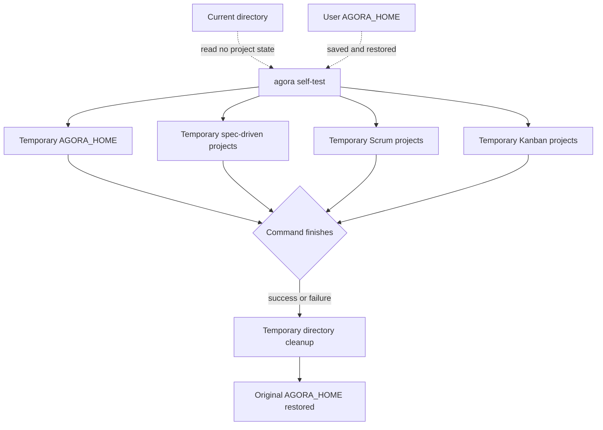

The temporary records are real Markdown protocol state while the test runs. They are intentionally
not retained because this command answers whether the installed framework conforms; it does not
create audit evidence for a real project.

## Reading the report

A successful report has this shape:

```json
{
  "ok": true,
  "scope": "bundled-role-conformance",
  "methods": 3,
  "actor_kinds": ["human", "ai-agent", "swarm"],
  "cases": [
    {
      "method": "scrum",
      "actor_kind": "ai-agent",
      "roles": ["product-owner", "scrum-master", "developer"],
      "terminal_state": "completed",
      "disallowed_assignments_rejected": 3
    }
  ],
  "role_assignments_verified": 24,
  "disallowed_assignments_rejected": 24
}
```

The real `cases` array contains all nine cases. Read the fields as follows:

| Field | Meaning |
| --- | --- |
| `ok` | Every case reached a valid terminal workspace |
| `scope` | The fixed assurance scope of this command |
| `methods` | Number of bundled Method Packs exercised |
| `actor_kinds` | Role-holder forms used in every Method Pack |
| `cases` | Per-method and per-form result, roles, terminal state, and rejection count |
| `role_assignments_verified` | Total permitted assignments exercised |
| `disallowed_assignments_rejected` | Total capability-compatible service assignments blocked |

For scripts and CI, trust the process exit status first and archive the JSON as diagnostic output.
The report is an observation of the run, not a durable authorization artifact.

## Where it fits in adoption

The self-test is the first layer in a progressive assurance model. Later layers add project state and
real runtimes only when the team needs them:

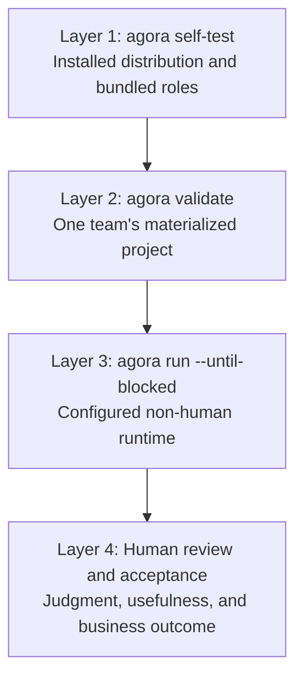

| Question | Command or activity |
| --- | --- |
| Did Agora install correctly and can every bundled role use human, AI, and swarm holders? | `agora self-test` |
| Is this project's materialized Markdown internally valid? | `agora validate` |
| Can the configured external agent runtime advance real work within its authority? | `agora run --until-blocked` |
| Is the produced work correct, useful, and acceptable? | Project tests plus accountable human review |
| Does the Agora source repository pass its complete contributor contract? | `uv run python scripts/verify_all.py` |

## Add it to CI

Keep the CI gate independent of provider credentials and project initialization:

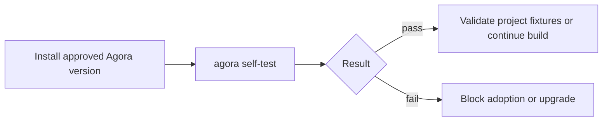

A provider-neutral job needs only Python and the approved Agora package:

```bash
python -m pip install "agora-framework==X.Y.Z"
agora self-test
```

Pin `X.Y.Z` to the version reviewed by the team. No LLM or ecosystem secrets should be added to this
job. Agora's own complete verification runner includes the same harness as a mandatory step:

```bash
uv run python scripts/verify_all.py --quiet
```

## Diagnose a failure

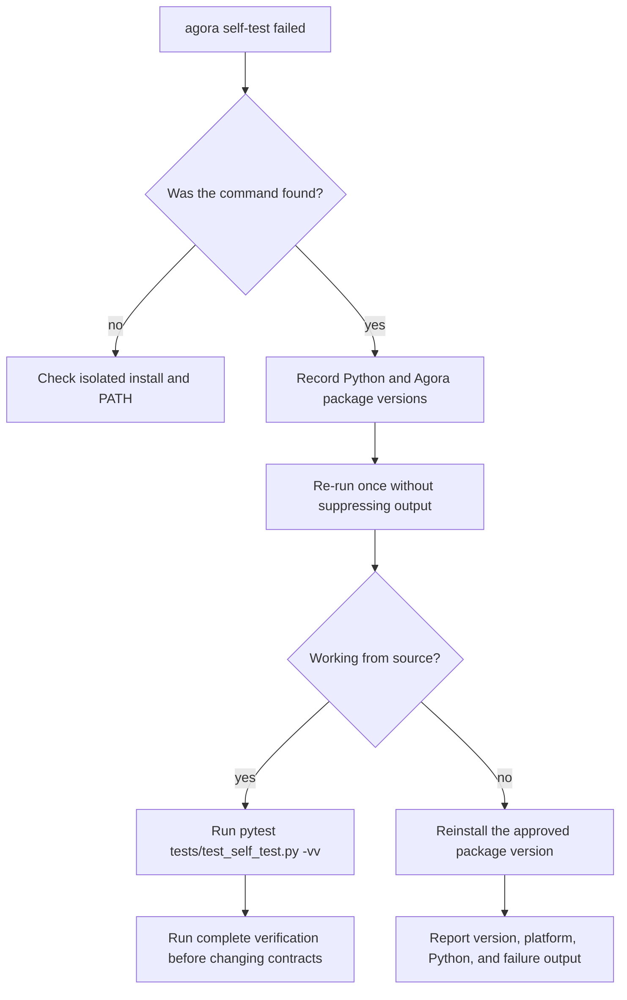

From a source checkout, use the focused tests for fast diagnosis:

```bash
uv run pytest tests/test_self_test.py -vv
```

Then run the complete repository contract before submitting a change:

```bash
uv run python scripts/verify_all.py
```

## Assurance boundary

The harness proves deterministic framework conformance for the installed bundled Method Packs. It
does not contact or evaluate an LLM, score human judgment, inspect product code, authenticate to an
external tool, or execute a custom Method Pack.

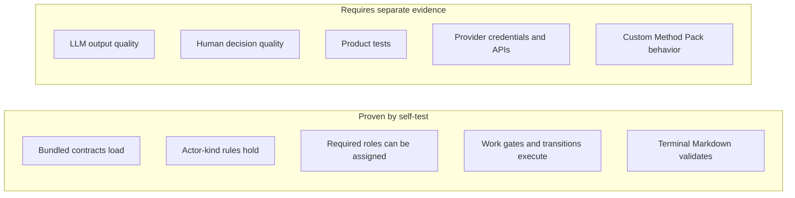

For a custom Method Pack, initialize a representative fixture, exercise its own success and failure
paths, and finish with `agora validate`. For a configured non-human runtime, use
`agora run --until-blocked`; use `agora inbox` for corresponding human authority and validation
steps. This preserves a small adoption path while keeping installation confidence, project
conformance, runtime behavior, and work quality as explicit layers.
