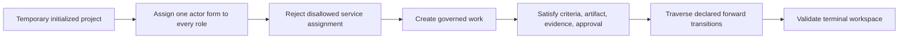

# Role conformance self-test

Run one command after installing Agora or before adopting it with a team:

```bash
agora self-test
```

The command needs no initialized project, provider account, LLM, key, or repository. It creates
temporary workspaces and removes them when complete. The JSON result is suitable for a terminal or
CI job.

## Coverage

The self-test exercises the bundled Spec-Driven, Scrum, and Kanban Method Packs with each supported
role-holder form:

| Actor form | What is exercised |
| --- | --- |
| `human` | One human actor holds every required role in the scenario |
| `ai-agent` | One AI actor holds every required role in the scenario |
| `swarm` | One ready child swarm holds every required role in the parent scenario |

Each of the nine scenarios creates governed work, satisfies its criterion, registers a required
artifact, records successful evidence and the required approval, follows only declared forward
transitions, reaches the Method Pack terminal state, and validates the resulting workspace. Every
role also rejects a capability-compatible `service` actor because the bundled role manifests do not
allow that actor kind.



## Assurance boundary

This is a deterministic conformance test. It proves that the installed Agora distribution can
govern every bundled method with human, AI, and swarm role holders. It does not score a person's
judgment or an LLM's output quality and does not contact a model provider.

Use `agora run --until-blocked` to exercise a configured non-human runtime against real work. Agora
will persist its session and stop at human authority. Use `agora inbox` for the corresponding human
steps, and finish with `agora validate`. This keeps the adoption path small while preserving a clear
boundary between deterministic framework assurance and project-specific performance evaluation.
