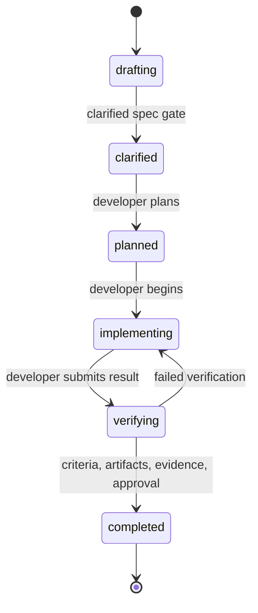

# Spec-driven delivery with humans and AI agents

This guide runs a complete change through Agora's bundled Spec-Driven Method Pack. The pack makes
the specification a durable gate: work cannot be planned until a current clarification run leaves
no unanswered questions, its clarification criteria are satisfied, and a `spec` artifact is
registered.

## Scenario

A team must define and implement webhook retry behavior:

- A human Spec Owner writes and accepts the contract.
- An AI agent or swarm acts as Developer and plans, implements, and verifies against that contract.
- The same actor may hold both roles when project policy permits, but Agora keeps their authorities
  distinct.

Configure and initialize the project:

```bash
agora configure \
  --integration codex \
  --provider openai \
  --model configured-by-codex \
  --default-method spec-driven

cd webhook-service
agora init
```

## Spec-driven contract

The installed contract is under `.agora/methods/spec-driven/`:

| Role | Required capabilities | Primary authority |
| --- | --- | --- |
| Spec Owner | `specification`, `acceptance` | Create and clarify the specification, satisfy criteria, accept completion |
| Developer | `implementation` | Plan, implement, verify, and record technical outputs |



The clarification and completion edges are separate gates. Clarification requires all criteria,
the `spec` artifact, and a current clarification run with zero unanswered questions. The gate
declares that stage-specific requirement explicitly, so implementation
plans and verification reports may be declared on the work from the beginning without blocking
clarification. Completion requires the work's full artifact contract, successful evidence, and Spec
Owner approval.

## Register and assign the pair

```bash
agora actor add --scope user \
  --id spec-owner --name "Webhook Product Engineer" --kind human \
  --capability specification --capability acceptance

agora actor add \
  --id implementation-agent --name "Webhook Developer" --kind ai-agent \
  --capability implementation

agora swarm create \
  --id webhook-retries \
  --objective "Specify and deliver deterministic webhook retries" \
  --method spec-driven

agora swarm assign --swarm webhook-retries \
  --role spec-owner --actor user:spec-owner
agora swarm assign --swarm webhook-retries \
  --role developer --actor implementation-agent
```

## Draft and clarify the specification

Create work in `drafting`. The bundled clarification gate interprets the criteria as questions that
must be resolved in the specification. For a guided terminal experience, use `agora work start`; it
selects a compatible assigned actor, collects criteria one at a time, reviews the complete plan, and
optionally registers an existing spec before writing.

```bash
agora work start --swarm webhook-retries
```

The declarative equivalent remains available for automation:

```bash
agora work create \
  --swarm webhook-retries \
  --id retry-contract \
  --title "Define webhook retry contract" \
  --description "Specify retry timing, termination, and delivery identity." \
  --by spec-owner \
  --criterion "retry-schedule:The retry schedule and maximum attempts are explicit" \
  --criterion "delivery-identity:The receiver can identify repeated delivery attempts" \
  --criterion "terminal-behavior:The terminal failure behavior is explicit" \
  --required-artifact spec \
  --required-artifact implementation-plan \
  --required-artifact verification-report
```

Before accepting the draft, the Spec Owner can generate focused questions and maintain a quality
checklist without changing the gate:

```bash
agora work clarify --swarm webhook-retries --work retry-contract --by spec-owner
agora work checklist add --swarm webhook-retries --work retry-contract \
  --title "Specification quality" \
  --item "Retry termination is explicit" \
  --item "Delivery identity is unambiguous" --by spec-owner
```

The Developer can later generate one Gherkin feature per criterion and a consistency review of
registered `repo://` artifacts:

```bash
agora work gherkin --swarm webhook-retries --work retry-contract \
  --by implementation-agent
agora work verify-consistency --swarm webhook-retries --work retry-contract \
  --by implementation-agent
agora work traceability --swarm webhook-retries --work retry-contract
```

This tooling is cross-method and advisory. In this example Gherkin is optional because the work does
not declare `gherkin-feature` as a required artifact. Add `--required-artifact gherkin-feature` when
creating the work, or name that kind in a Method Pack gate, to make its presence mandatory. Generated
content still does not satisfy a criterion, approve work, or run an executable test suite. If the
description, criteria, or relevant artifacts change, `traceability` and `agora validate` identify
stale generated output for explicit regeneration.

Write the actual specification in the product repository, answer the generated questions there,
then register it. Agora stores its URI and governance state; it does not hide the specification
inside chat history.

```bash
agora artifact add --swarm webhook-retries --work retry-contract \
  --kind spec --uri repo://docs/specs/webhook-retries.md --by spec-owner

# Repeat specification edits and clarification until the latest run returns
# no unanswered questions.
agora work clarify --swarm webhook-retries --work retry-contract --by spec-owner

agora work criterion-satisfy --swarm webhook-retries --work retry-contract \
  --criterion retry-schedule --stage specified --by spec-owner
agora work criterion-satisfy --swarm webhook-retries --work retry-contract \
  --criterion delivery-identity --stage specified --by spec-owner
agora work criterion-satisfy --swarm webhook-retries --work retry-contract \
  --criterion terminal-behavior --stage specified --by spec-owner

agora work transition --swarm webhook-retries --work retry-contract \
  --to clarified --by spec-owner
```

The transition fails if even one criterion or the `spec` artifact is missing, clarification was not
run, its inputs became stale, or its latest run left an unanswered question. Later required
artifacts are deferred by the clarification gate and enforced at completion. No separate approval
is needed here because the Spec Owner is the actor making the clarification decision.

## Plan and implement against the spec

The Developer owns the planning and implementation transitions, while the Spec Owner explicitly
confirms that every criterion is covered by the durable implementation plan:

```bash
agora work transition --swarm webhook-retries --work retry-contract \
  --to planned --by implementation-agent

agora artifact add --swarm webhook-retries --work retry-contract \
  --kind implementation-plan --uri repo://docs/plans/webhook-retries.md \
  --by implementation-agent

agora work criterion-satisfy --swarm webhook-retries --work retry-contract \
  --criterion retry-schedule --stage planned --by spec-owner
agora work criterion-satisfy --swarm webhook-retries --work retry-contract \
  --criterion delivery-identity --stage planned --by spec-owner
agora work criterion-satisfy --swarm webhook-retries --work retry-contract \
  --criterion terminal-behavior --stage planned --by spec-owner

agora work transition --swarm webhook-retries --work retry-contract \
  --to implementing --by implementation-agent
```

The `planned -> implementing` edge fails closed if the plan artifact is absent or a criterion has
not reached `planned`. This keeps implementation from starting merely because a state label was
advanced.

Prepare durable model context before implementation:

```bash
agora start \
  --id webhook-implementation \
  --actor implementation-agent \
  --swarm webhook-retries \
  --work retry-contract
```

For a Codex integration, the projected operational command may be invoked with:

```text
$agora-execute Continue webhook-retries/retry-contract as implementation-agent.
Implement the clarified specification without changing its scope, test it, and record evidence.
```

Record the implementation outputs and the required verification report:

```bash
agora artifact add --swarm webhook-retries --work retry-contract \
  --kind source-code --uri repo://src/webhooks/retry.py --by implementation-agent
agora artifact add --swarm webhook-retries --work retry-contract \
  --kind test-report --uri ci://webhook-service/builds/77/tests --by implementation-agent
agora artifact add --swarm webhook-retries --work retry-contract \
  --kind verification-report --uri repo://docs/reports/webhook-retries.md \
  --by implementation-agent

agora work transition --swarm webhook-retries --work retry-contract \
  --to verifying --by implementation-agent

agora evidence add --swarm webhook-retries --work retry-contract \
  --type contract-test-run --result success \
  --artifact ci://webhook-service/builds/77/tests --by implementation-agent

agora work criterion-satisfy --swarm webhook-retries --work retry-contract \
  --criterion retry-schedule --stage implemented --by implementation-agent
agora work criterion-satisfy --swarm webhook-retries --work retry-contract \
  --criterion delivery-identity --stage implemented --by implementation-agent
agora work criterion-satisfy --swarm webhook-retries --work retry-contract \
  --criterion terminal-behavior --stage implemented --by implementation-agent

agora work criterion-satisfy --swarm webhook-retries --work retry-contract \
  --criterion retry-schedule --stage verified --by implementation-agent
agora work criterion-satisfy --swarm webhook-retries --work retry-contract \
  --criterion delivery-identity --stage verified --by implementation-agent
agora work criterion-satisfy --swarm webhook-retries --work retry-contract \
  --criterion terminal-behavior --stage verified --by implementation-agent
```

Failed verification returns through the declared `verifying -> implementing` edge. Changing the
accepted specification instead requires a new draft rather than silently moving the target.

## Accept the increment

The Spec Owner records final acceptance and owns the gated terminal transition:

```bash
agora work criterion-satisfy --swarm webhook-retries --work retry-contract \
  --criterion retry-schedule --stage accepted --by spec-owner
agora work criterion-satisfy --swarm webhook-retries --work retry-contract \
  --criterion delivery-identity --stage accepted --by spec-owner
agora work criterion-satisfy --swarm webhook-retries --work retry-contract \
  --criterion terminal-behavior --stage accepted --by spec-owner

agora work finish --swarm webhook-retries --work retry-contract --by spec-owner
```

`work finish` reviews the completed criterion stages and durable evidence, then asks the Spec Owner
to record the approval and terminal transition. The equivalent declarative `approval add` and
`work transition` commands remain available for automation.

## What Agora models

| Spec-driven concern | Agora representation |
| --- | --- |
| Specification | Product artifact referenced by `artifacts.md` |
| Open questions | Acceptance criteria on drafting work |
| Clarification | Gated `drafting -> clarified` transition |
| Implementation plan | Developer responsibility after clarification |
| Verification | Evidence and artifact references in `verifying` |
| Acceptance | Spec Owner approval and terminal transition |
| Rework | Explicit `verifying -> implementing` edge |

Agora does not prescribe a specification format, programming language, LLM, planning template, or
test framework. A project-local Method Pack can require additional design, plan, source, security,
or release artifacts while preserving the same Markdown-first protocol.

## Choosing between spec-driven, Scrum, and Kanban

All three are equally supported Method Packs; `spec-driven` is only the *default*, not a requirement.

- Prefer **spec-driven** for small teams, solo developers, or an agent-paired workflow where the
  clarify-before-plan discipline matters more than sprint cadence or continuous-flow WIP limits.
- Prefer **Scrum** when the team already runs sprints and needs the Product Owner / Scrum Master /
  Developer split — see [Scrum delivery](scrum-delivery.md).
- Prefer **Kanban** for continuous flow with WIP limits and no fixed iteration, using its
  `service-request-manager`, `flow-manager`, and `delivery` roles.

Switch at project creation with `agora configure --default-method scrum` (or `kanban`), or per swarm
with `agora swarm create --method scrum`.
