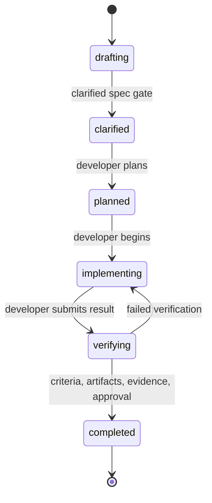

# Spec-driven delivery with humans and AI agents

This guide runs a complete change through Agora's bundled Spec-Driven Method Pack. The pack makes
the specification a durable gate: work cannot be planned until its questions are resolved, its
clarification criteria are satisfied, and a `spec` artifact is registered.

## Scenario

A team must define and implement webhook retry behavior:

- A human Spec Owner writes and accepts the contract.
- An AI agent or swarm acts as Developer and plans, implements, and verifies against that contract.
- The same actor may hold both roles when project policy permits, but Agora keeps their authorities
  distinct.

Configure and initialize the project:

```bash
agora configure \
  --integration codex \
  --provider openai \
  --model configured-by-codex \
  --default-method spec-driven

cd webhook-service
agora init
```

## Spec-driven contract

The installed contract is under `.agora/methods/spec-driven/`:

| Role | Required capabilities | Primary authority |
| --- | --- | --- |
| Spec Owner | `specification`, `acceptance` | Create and clarify the specification, satisfy criteria, accept completion |
| Developer | `implementation` | Plan, implement, verify, and record technical outputs |



The clarification and completion edges are separate gates. Clarification requires all criteria and
required artifacts recorded on the work item; completion additionally requires successful evidence
and Spec Owner approval.

## Register and assign the pair

```bash
agora actor add --scope user \
  --id spec-owner --name "Webhook Product Engineer" --kind human \
  --capability specification --capability acceptance

agora actor add \
  --id implementation-agent --name "Webhook Developer" --kind ai-agent \
  --capability implementation

agora swarm create \
  --id webhook-retries \
  --objective "Specify and deliver deterministic webhook retries" \
  --method spec-driven

agora swarm assign --swarm webhook-retries \
  --role spec-owner --actor user:spec-owner
agora swarm assign --swarm webhook-retries \
  --role developer --actor implementation-agent
```

## Draft and clarify the specification

Create work in `drafting`. The bundled clarification gate interprets the criteria as questions that
must be resolved in the specification. Keep only clarification-time outputs in `--required-artifact`;
otherwise implementation outputs would be required before the work could become `clarified`.

```bash
agora work create \
  --swarm webhook-retries \
  --id retry-contract \
  --title "Define webhook retry contract" \
  --description "Specify retry timing, termination, and delivery identity." \
  --by spec-owner \
  --criterion "retry-schedule:The retry schedule and maximum attempts are explicit" \
  --criterion "delivery-identity:The receiver can identify repeated delivery attempts" \
  --criterion "terminal-behavior:The terminal failure behavior is explicit" \
  --required-artifact spec
```

Write the actual specification in the product repository, then register it. Agora stores its URI
and governance state; it does not hide the specification inside chat history.

```bash
agora artifact add --swarm webhook-retries --work retry-contract \
  --kind spec --uri repo://docs/specs/webhook-retries.md --by spec-owner

agora work criterion-satisfy --swarm webhook-retries --work retry-contract \
  --criterion retry-schedule --by spec-owner
agora work criterion-satisfy --swarm webhook-retries --work retry-contract \
  --criterion delivery-identity --by spec-owner
agora work criterion-satisfy --swarm webhook-retries --work retry-contract \
  --criterion terminal-behavior --by spec-owner

agora work transition --swarm webhook-retries --work retry-contract \
  --to clarified --by spec-owner
```

The transition fails if even one criterion or the `spec` artifact is missing. No separate approval
is needed here because the Spec Owner is the actor making the clarification decision.

## Plan and implement against the spec

The Developer owns the next three forward transitions:

```bash
agora work transition --swarm webhook-retries --work retry-contract \
  --to planned --by implementation-agent
agora work transition --swarm webhook-retries --work retry-contract \
  --to implementing --by implementation-agent
```

Prepare durable model context before implementation:

```bash
agora start \
  --id webhook-implementation \
  --actor implementation-agent \
  --swarm webhook-retries \
  --work retry-contract
```

For a Codex integration, the projected operational command may be invoked with:

```text
$agora-execute Continue webhook-retries/retry-contract as implementation-agent.
Implement the clarified specification without changing its scope, test it, and record evidence.
```

Record implementation outputs even though only the `spec` kind is mandatory in the bundled pack:

```bash
agora artifact add --swarm webhook-retries --work retry-contract \
  --kind source-code --uri repo://src/webhooks/retry.py --by implementation-agent
agora artifact add --swarm webhook-retries --work retry-contract \
  --kind test-report --uri ci://webhook-service/builds/77/tests --by implementation-agent

agora work transition --swarm webhook-retries --work retry-contract \
  --to verifying --by implementation-agent

agora evidence add --swarm webhook-retries --work retry-contract \
  --type contract-test-run --result success \
  --artifact ci://webhook-service/builds/77/tests --by implementation-agent
```

Failed verification returns through the declared `verifying -> implementing` edge. Changing the
accepted specification instead requires a new draft rather than silently moving the target.

## Accept the increment

The Spec Owner records final acceptance and owns the gated terminal transition:

```bash
agora approval add --swarm webhook-retries --work retry-contract \
  --role spec-owner --by spec-owner \
  --note "Implementation verified against the clarified specification"

agora work transition --swarm webhook-retries --work retry-contract \
  --to completed --by spec-owner
```

Completion requires every criterion to remain satisfied, all required artifacts to remain present,
at least one successful evidence record, and Spec Owner approval.

## What Agora models

| Spec-driven concern | Agora representation |
| --- | --- |
| Specification | Product artifact referenced by `artifacts.md` |
| Open questions | Acceptance criteria on drafting work |
| Clarification | Gated `drafting -> clarified` transition |
| Implementation plan | Developer responsibility after clarification |
| Verification | Evidence and artifact references in `verifying` |
| Acceptance | Spec Owner approval and terminal transition |
| Rework | Explicit `verifying -> implementing` edge |

Agora does not prescribe a specification format, programming language, LLM, planning template, or
test framework. A project-local Method Pack can require additional design, plan, source, security,
or release artifacts while preserving the same Markdown-first protocol.
