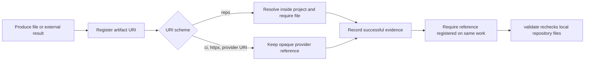

# Complete verification

Agora has two complementary verification scopes. `agora validate` audits one initialized workspace.
The repository runner audits the framework implementation, every bundled Markdown contract, every
agent environment, all executable swarm scenarios, and the built distribution.

## Validate an initialized workspace

Run validation from the project or target it from any IDE, CLI, CI worker, or cloud environment:

```bash
agora validate
agora --project /path/to/project validate
```

The terminal report is human-readable. When captured or redirected, the same report is JSON. `ok` is
false and the process exits with status `1` when an error is present.
The `checked` object reports how many records of each kind were successfully parsed, including
`commands` and `adapters`.

Portable commands under `.agora/commands` must have:

- A filename that is a lowercase command id.
- A front matter `name` equal to `agora-<command-id>`.
- A non-empty `description`.
- Non-empty instructions with no unresolved template values.

For Codex and Claude, every portable command must have a matching environment adapter:

```text
Codex:  .agents/skills/agora-<command-id>/SKILL.md
Claude: .claude/commands/agora.<command-id>.md
Generic: .agora/commands/<command-id>.md
```

Codex and Claude adapter content must match the portable command exactly. A missing or malformed
adapter is an error. An adapter without a portable command is reported as a warning. This keeps
environment packaging separate without allowing the governing instructions to diverge silently.

`agora doctor` performs the faster availability check and reports the installed adapter count, for
example `codex: 8/8 commands available`. In a Git repository it also fails when ignore rules would
prevent generated governance state from being committed.

## Artifact and evidence integrity

Successful evidence must reference at least one artifact already registered on the same work item.
Agora rejects missing or duplicate references. A `repo://path/to/file` URI has stronger local
semantics: it must be a portable path to a regular file inside the project both when registered and
when evidence is recorded.



For example:

```bash
agora artifact add \
  --swarm delivery --work feature --by agent \
  --kind test-report --uri repo://reports/feature-tests.txt
agora evidence add \
  --swarm delivery --work feature --by agent \
  --type test-run --result success \
  --artifact repo://reports/feature-tests.txt
```

External references remain provider-neutral because Agora does not dereference them. Their Tool Run,
signature, approval, or provider snapshot supplies the stronger proof when policy requires it.

## Verify the complete repository

Install development dependencies, then run the Python verification entry point:

```bash
uv sync --extra dev
uv run python scripts/verify_all.py
```

The runner continues through independent failures and returns status `1` if any step fails. It runs:

1. Python formatting verification.
2. Python linting.
3. The complete test suite.
4. Local Markdown link validation.
5. The bundled human, AI-agent, and swarm [role conformance test harness](self-test.md).
6. Every `samples/*/run.py` scenario.
7. Source and wheel distribution builds.

The sample matrix covers human and AI actors, recursive swarms, delegation, handoffs, interruptions,
signed remote registry distribution, custom methods, tools, operational queries, and Codex, Claude,
and generic adapters. It prepares contexts but does not launch an LLM or make provider API requests.
Some integration samples launch deterministic local child processes so the normal executable,
timeout, output capture, and result-inspection paths are exercised. In particular, `jira-cli`
places an ACLI-compatible simulator on a temporary `PATH`; it never contacts Jira Cloud and its
temporary runtime is not installed for the user.

Use quiet output in CI:

```bash
uv run python scripts/verify_all.py --quiet
```

For a faster local loop, omit scenarios or packaging:

```bash
uv run python scripts/verify_all.py --skip-samples --skip-build
```

These flags narrow developer verification only. They do not alter Agora project policy or persisted
state.

## GitHub Actions CI

The repository includes `.github/workflows/ci.yml`. Pull requests and pushes to `main` run:

1. The test suite against Python 3.11, 3.12, and 3.13 using the locked dependency graph.
2. Complete verification on Python 3.13, including formatting, lint, documentation, every sample,
   and both distributions.

The workflow grants only `contents: read`, disables persisted checkout credentials, cancels stale
runs for the same branch, and pins third-party actions to immutable commit SHAs. A manual
`workflow_dispatch` trigger is also available. Local development continues to use the same Python
entry point as CI, so the hosted workflow does not define a second verification contract.

## Tagged releases

Pushing a `vMAJOR.MINOR.PATCH` tag starts `.github/workflows/release.yml`. The workflow runs complete
verification, requires the tag to match `project.version` in `pyproject.toml`, rebuilds the wheel and
source distribution, and generates `SHA256SUMS` through `scripts/prepare_release.py`. GitHub CLI then
creates a release from the existing tag with generated notes and uploads those three artifacts.

The release job receives `contents: write` only because GitHub release creation requires it. It
uploads the already verified distributions as a short-lived workflow artifact. A separate `pypi`
environment job receives only `id-token: write`, downloads those exact files, and publishes through
PyPI Trusted Publishing. Checkout credentials remain disabled and every action is pinned to an
immutable SHA. The PyPI project must authorize this repository, workflow, and `pypi` environment as
its trusted publisher before the first tag is released.

The trusted publisher identity is an exact tuple, not a repository URL redirect. For this project it
must match:

| Claim | Expected value |
| --- | --- |
| GitHub owner | `Modern-Ash` |
| Repository | `agora` |
| Workflow | `release.yml` |
| Environment | `pypi` |

After transferring the repository between owners or organizations, update the publisher in the PyPI
project settings before retrying the failed environment job. A valid GitHub OIDC token from the new
owner is rejected with `invalid-publisher` while PyPI still stores the old owner or repository. The
debug claims emitted by the publishing action should be compared with the intended configuration;
they should not be copied blindly when an unexpected workflow, ref, or environment appears.

Updating the homepage or repository URL on PyPI does not update the trusted publisher identity.
Those are separate settings. No API token is needed when the exact trusted publisher is configured,
and a failed publish can be retried from the existing verified release run after correcting PyPI.

After publication, a separate unprivileged Python 3.11 job installs the exact tagged version from
the public PyPI index. It allows bounded retries for index propagation, then runs `agora quickstart`
and `agora validate` in a temporary project and confirms the installed distribution version. This
consumer smoke test has no publishing identity or repository write permission.

## Other CI systems

```bash
uv sync --extra dev
uv run python scripts/verify_all.py --quiet
uv run agora --project ./fixture-project validate
```

The first command proves the framework distribution and bundled scenarios. The second proves the
specific persisted workspace used by the team. Neither command repairs invalid Markdown; changes
remain explicit and reviewable through the filesystem and Git.
