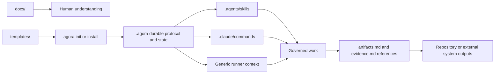

# Documentation and artifact locations

Agora uses Markdown for both explanatory documentation and operational records. The file extension
does not determine the role of a file; its directory, schema, ownership, and lifecycle do.

## Classification

| Class | Source location | Materialized location | Consumer | Mutability |
| --- | --- | --- | --- | --- |
| Product documentation | `docs/` | Not materialized | Humans and contributors | Edited with the product |
| Plugin run output | `docs/superpowers/` | Plugin-owned | Contributors and the originating plugin | Managed by plugin runs |
| Portable agent commands | `templates/commands/` | `.agora/commands/` | Humans, agents, and generic runners | Customized per project |
| Project protocol sources | `templates/project/` | `.agora/` | Every project participant | Customized per project |
| Method Pack sources | `templates/methods/` | `.agora/methods/` | Kernel, humans, and agents | Installed and versioned |
| Tool Pack sources | `templates/tools/` | `.agora/tools/` | Kernel, agents, and tool runners | Installed and versioned |
| Reviewed CLI adapters | `templates/adapters/` | `.agora/tools/` when installed | Kernel and native CLIs | Explicitly installed |
| Environment adapters | Generated from portable commands | `.agents/skills/` or `.claude/commands/` | Codex or Claude | Generated, then reviewable |
| Durable collaboration state | Created by Agora commands | `.agora/` | Kernel, humans, and agents | Changed only through governed operations |
| Product outputs | Project files or external systems | Referenced from `artifacts.md` | Humans, agents, and lifecycle gates | Owned by their producing system |

`docs/superpowers/` is intentionally retained as the output location of Superpowers plugin runs. It
is not normative Agora protocol, a bundled Method Pack, or project runtime state.



## Distribution sources

The Markdown under `templates/` is source material shipped with the Python distribution. It is not
the state of a governed project until Agora copies or installs it into a project or user scope.

### Portable commands

[`templates/commands/`](../../templates/commands/) contains model-independent instructions such as `objective`, `specify`,
`execute`, `review`, and `complete`. Initialization always copies them to:

```text
.agora/commands/<command>.md
```

The selected integration adds one environment-specific projection:

```text
Codex:   .agents/skills/agora-<command>/SKILL.md
Claude:  .claude/commands/agora.<command>.md
Generic: .agora/commands/<command>.md
```

The portable `.agora/commands/` file is authoritative. `agora validate` detects drift between it and
the Codex or Claude projection.

### Shared project protocol

[`templates/project/`](../../templates/project/) provides the initial collaboration contract:

```text
.agora/project.md
.agora/constitution.md
.agora/PROTOCOL.md
.agora/STANDARDS.md
.agora/PACKS.lock.md
.agora/tools/TOOLS.md
```

These files are operational inputs. Agents read them before acting; the Python kernel validates the
structured portions; the repository and Git preserve review history.

### Method and Tool Packs

[`templates/methods/`](../../templates/methods/) contains example lifecycle contracts. Their `METHOD.md`, roles, gates, and
transitions define allowed work states and actions. Scrum, Kanban, and spec-driven development are
bundled examples rather than privileged kernel workflows.

[`templates/tools/`](../../templates/tools/) contains provider-neutral operation contracts.
[`templates/adapters/`](../../templates/adapters/) contains
reviewed translations to native provider CLIs. Finding a CLI on `PATH` never installs its adapter or
grants its capabilities.

## Durable project records

Agora creates current collaboration state under `.agora/`. Common records include:

```text
.agora/actors/<actor>/ACTOR.md
.agora/swarms/<swarm>/SWARM.md
.agora/swarms/<swarm>/work/<work>/WORK.md
.agora/swarms/<swarm>/work/<work>/artifacts.md
.agora/swarms/<swarm>/work/<work>/evidence.md
.agora/swarms/<swarm>/work/<work>/approvals.md
.agora/actions/<action>/ACTION.md
.agora/delegations/<delegation>/DELEGATION.md
.agora/sessions/<session>/SESSION.md
.agora/sessions/<session>/CONTEXT.md
.agora/sessions/<session>/RESULT.md
.agora/tool-runs/<run>/RUN.md
```

These are neither manuals nor disposable prompts. They are durable governed records shared through
the filesystem and Git. Chat history is not a substitute for them.

## Work products versus Agora records

Agora normally references produced work rather than copying opaque content. A specification, source
tree, test report, ticket, build, deployment, or external page remains in its owning repository or
provider. The work item's `artifacts.md` records its kind, URI, producer, and timestamp. Its
`evidence.md` records verification outcomes and artifact references used by lifecycle gates.

The catalog at `.agora/artifacts/ARTIFACTS.md`, sourced from
`templates/project/artifacts/ARTIFACTS.md`, defines common artifact kinds. It is a project policy
catalog, not a container for the product bytes.

## Repository-specific agent instructions

The root `AGENTS.md` governs coding agents contributing to the Agora repository itself. It is not
copied by `agora init` and is not part of the portable project protocol. Governed projects receive
their instructions from `.agora/PROTOCOL.md`, the active Method Pack, role contracts, portable
commands, and the selected environment adapter.

## Practical rule

Use this decision order when reading a Markdown file:

1. Under `docs/`: explanatory material, except explicitly plugin-owned run output.
2. Under `templates/`: distribution source for a protocol, pack, command, or reviewed adapter.
3. Under `.agora/`: authoritative project policy or durable collaboration state.
4. Under `.agents/` or `.claude/`: environment projection of a portable agent command.
5. Referenced by `artifacts.md`: a work product owned by its repository or external system.
