# Existing codebase feature pilot

This sample is the executable acceptance test for adopting a real, non-empty Git repository. It
starts with an existing calculator and passing tests, runs Agora's zero-mutation preflight, creates
an isolated feature branch, delivers a backward-compatible feature, records resolvable repository
artifacts and successful test evidence, completes the Spec-Driven lifecycle, and validates all
durable state.

```mermaid
flowchart LR
    A[Existing code and tests on main] --> B[adopt --check]
    B --> C[quickstart on agora/percentage-discount]
    C --> D[Specification and acceptance criterion]
    D --> E[Implement feature]
    E --> F[Run existing and feature tests]
    F --> G[Register repo artifacts and evidence]
    G --> H[Human approval]
    H --> I[Completed work and agora validate]
```



Run it from the Agora checkout:

```bash
uv run python samples/existing-codebase-feature/run.py
```

The pilot uses a temporary directory and a local Git repository. It needs no LLM, provider account,
network access, private key, or GitHub repository. Its external test command is a structured Python
process, while Agora remains language- and runner-independent.
