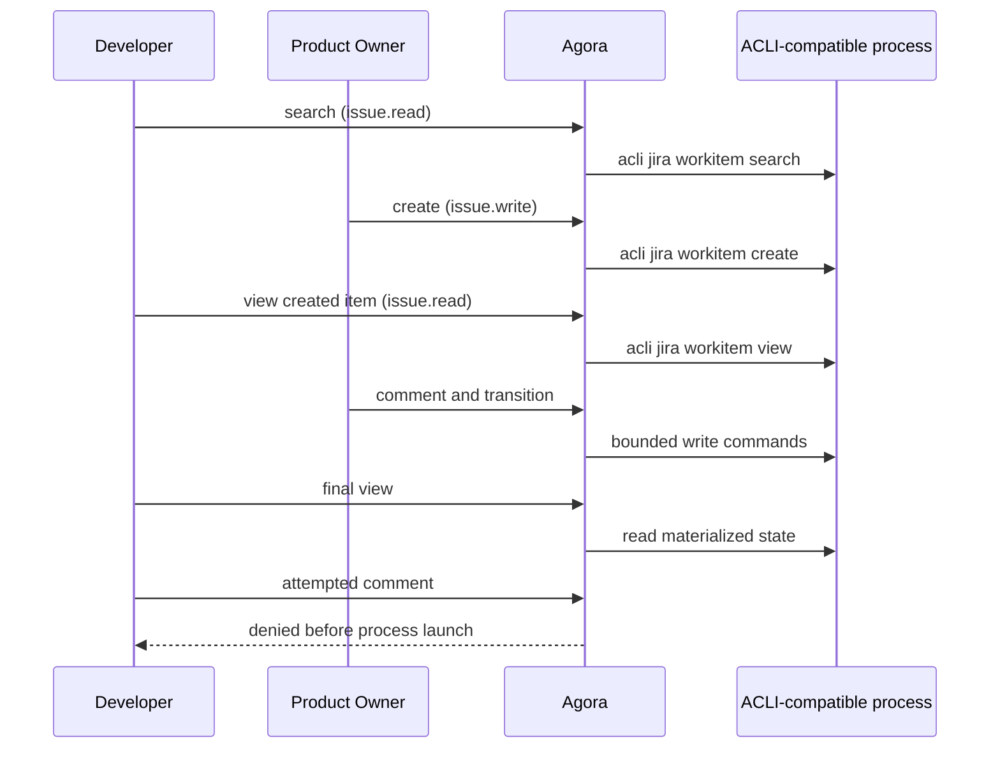

# Jira ACLI adapter sample

This sample installs the reviewed Jira adapter and launches its native Atlassian CLI commands
against a deterministic, ACLI-compatible process. It exercises search, create, view, comment, and
transition, then reads the final item to prove that the remote-side state changed. The process is a
local simulation: it does not contact Jira Cloud.

Each launched command passes through Agora's normal runtime compatibility, role authority, timeout,
and output-limit checks. Its JSON output is persisted in `RESULT.md` and displayed through Agora's
typed Tool Run inspection. The Product Owner receives write and transition authority from the active
Scrum role. The Developer can search and view Jira but cannot comment because installing the adapter
does not grant `issue.write`.

Run it from the repository root:

```bash
uv run python samples/jira-cli/run.py
```

## Exercised flow



The deterministic item starts at `AGORA-43`. The final read must show:

```json
{
  "key": "AGORA-43",
  "status": "In Progress",
  "comments": ["Governed comment from Agora"]
}
```

Every successful process creates a separate Tool Run. The denied Developer comment creates no Tool
Run because capability validation occurs before command preparation or launch.

The output includes the temporary project path. Inspect any captured response through the CLI:

```bash
agora --project /tmp/agora-jira-cli-sample-.../project \
  tool result --run verify-created-jira-work
```

For live Jira Cloud execution, install a compatible ACLI, authenticate and select the intended Jira
site outside Agora, install the same `jira` adapter in the real project, prepare and inspect the
command, and only then repeat the invocation with `--launch`. The sample process is deliberately not
placed on `PATH` outside its temporary directory, and Agora never receives Jira credentials.

Before a live write, verify each boundary explicitly:

```bash
acli --version
agora tool adapter list --check
agora tool invoke ...                 # prepare only
agora tool result --run <run-id>      # result is null before launch
agora tool launch --run <run-id>      # execute the reviewed prepared command
agora tool result --run <run-id>      # inspect captured provider output
agora validate
```

`tool launch` revalidates the recorded operation and current policy; actors configured for
authentication must also supply the external signature. ACLI owns site selection, account
permissions, network access, and provider errors. Agora owns role authority, exact command
preparation, execution bounds, attribution, and durable evidence.
